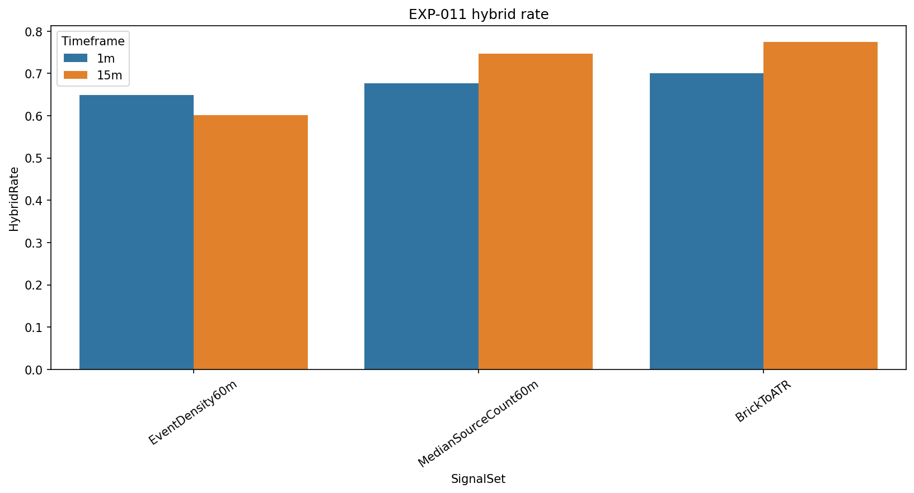
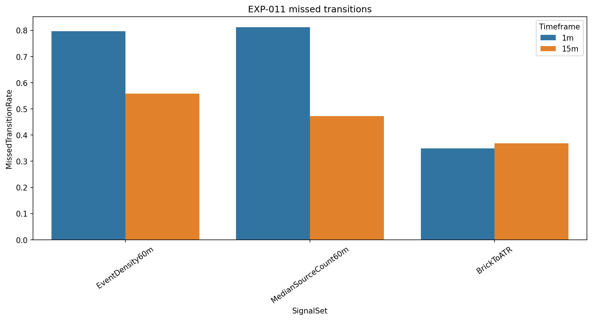
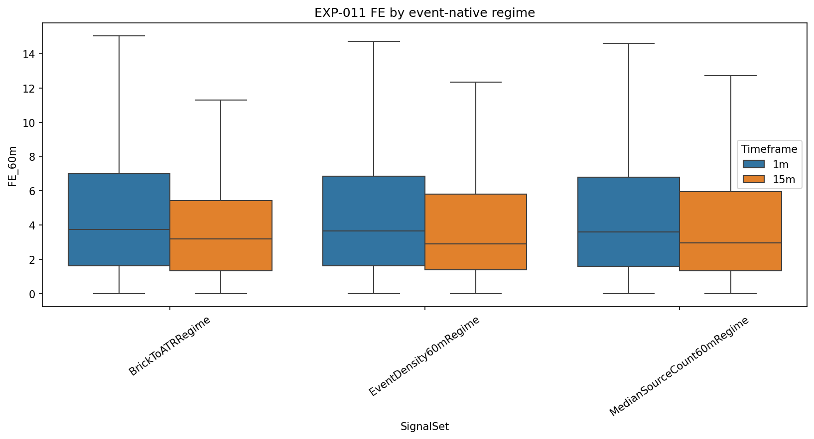

# Experiment Report: EXP-011 - Event-Native Volatility Regime Detection

## Status: REFUTED

**Date**: 2026-05-17  
**Instruments**: EURUSD, XAUUSD, BTCUSD, USTEC  
**Feature Categories**: Renko ATR-14, Time Bars

## Question

Can Renko internal features define volatility regimes that align better with Renko event boundaries than time-bar-derived regime labels?

## Hypothesis

Volatility-regime labels derived from Renko event density, source-bar count per brick, and brick-to-ATR ratio identify Renko regime states with lower boundary cost and fewer missed transitions than time-bar-derived regime labels applied to Renko events.

## Method Summary

The experiment generated Renko ATR-14 from holdout-excluded 1-minute and 15-minute source bars. It computed three fixed Renko-native features, froze tercile boundaries on the train segment, then reported feature-specific hybrid rate, missed-transition rate, agreement with time-bar regimes, and descriptive FE60/AE60 strata.

## Key Findings

### Hybrid Rates Remained High

At 15 minutes, event-density hybrid rates were `0.564-0.659`, median-source-count rates were `0.739-0.750`, and brick-to-ATR rates were `0.750-0.788`.

### Brick-to-ATR Lowered Missed Transitions but Not Boundary Cost Overall

Brick-to-ATR missed-transition rates were lowest (`0.324-0.407` at 15 minutes), but agreement with time-bar regimes was only `0.211-0.250`. This is not a supported regime replacement or companion under the approved criteria.

### Signal-Quality Strata Were Not Enough

Some FE60/AE60 strata differ descriptively, especially for brick-to-ATR, but the primary boundary-cost test fails. No feature should be selected for Phase 3 on signal-quality separation alone.

## Conclusion

**Hypothesis REFUTED.**

The fixed Renko-native features describe Renko mechanics, but they do not define volatility regimes with acceptable boundary behavior against the canonical time-bar regime reference. Time-bar-derived regimes should remain the default regime frame for Renko signal analysis.

## Limitations

- Only three pre-fixed features and tercile segmentation were tested.
- Tied discrete feature boundaries can collapse medium strata.
- The experiment does not rule out all event-native diagnostics; it rejects this specific regime-labeling approach.

## Recommended Next Experiments

1. Defer event-native regime replacement unless Phase 3 produces a narrower diagnostic need.
2. If revisited, scope Renko-native features as explanatory covariates rather than volatility regime labels.

## Artifacts

| Artifact | Path |
|----------|------|
| Scope | [scope.md](scope.md) |
| Analysis Plan | [analysis-plan.md](analysis-plan.md) |
| Code | [code/](code/) |
| Audit | [audit.md](audit.md) |
| Results | [results.md](results.md) |
| Governance Reviews | [governance/](governance/) |
| Plots | [plots/](plots/) |
