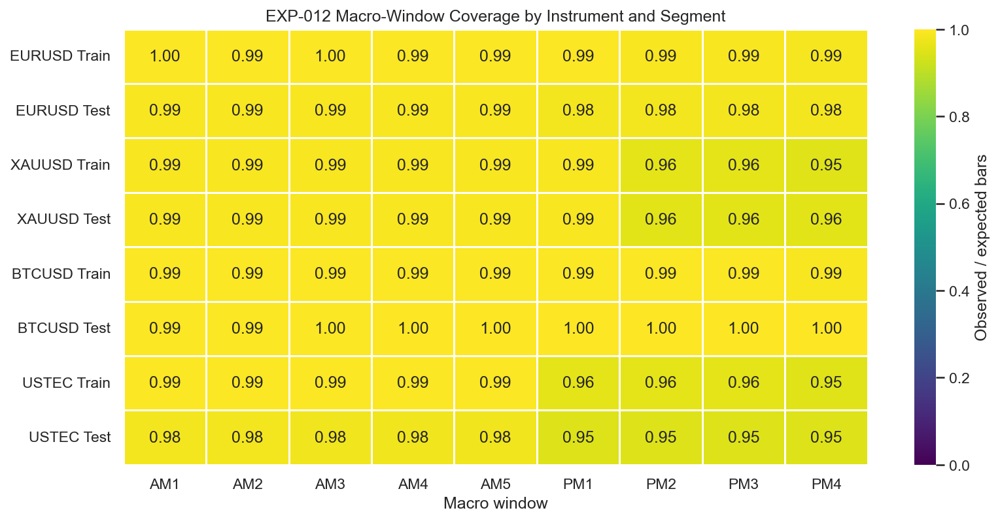
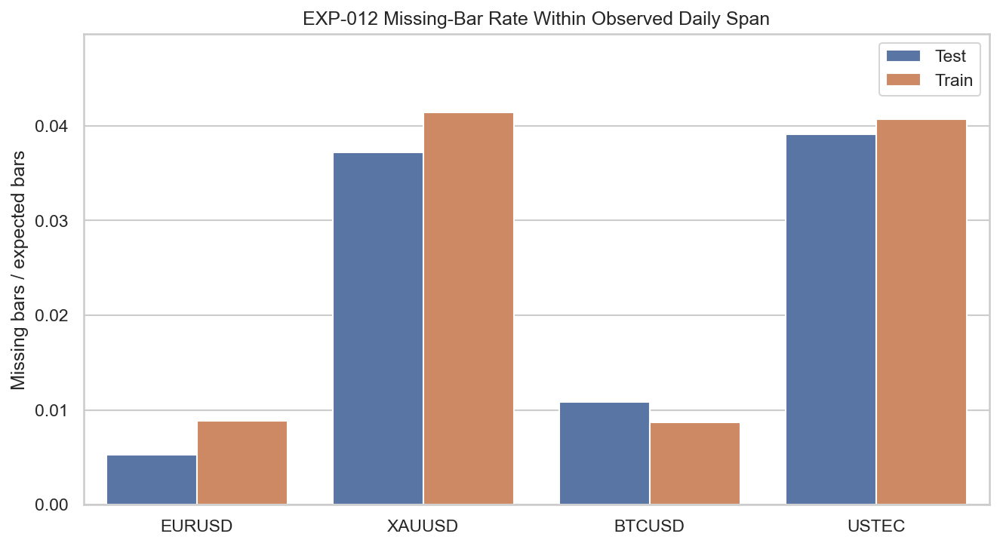

# Experiment Report: EXP-012 - ICT Data Readiness and Feasibility

## Status: SUPPORTED

**Date**: 2026-05-23  
**Instruments**: EURUSD, XAUUSD, BTCUSD, USTEC  
**Feature Categories**: 1-minute Time Bars, NY Macro Windows, Data Readiness

## Question

Is the current time-bar dataset sufficient for ICT macro-window research?

## Hypothesis

The available 1-minute time-bar datasets are sufficient for deterministic NY-time ICT macro-window research if timezone conversion, session coverage, missing-bar rates, and cost assumptions can be documented without using unavailable data.

## Method Summary

The experiment inventoried each scoped time-bar dataset, converted `CloseTime` to `America/New_York` under the documented UTC assumption, summarized macro-window coverage and missing-bar behavior inside the holdout-excluded analysis set, and checked whether transaction-cost fields were present in the stored schema. Because no bid/ask or commission fields exist in the current time-bar files, the run also wrote the approved proxy cost scenarios for later experiments.

## Key Findings

### All Macro-Window Families Cleared the Threshold

Every instrument and train/test segment exceeded the scoped `0.80` macro-family coverage threshold. The lowest family ratio was `USTEC Test PM = 0.9459`, and the highest was `BTCUSD Test PM = 0.9995`.

### Missing-Bar Rates Were Quantified and Moderate

Missing-bar rates within the observed daily span ranged from `0.0052` (`EURUSD Test`) to `0.0414` (`XAUUSD Train`). PM session quality is weaker than AM for `USTEC` and `XAUUSD`, but still well above the failure threshold.

### Cost Proxies Are Required for Later ICT Studies

The time-bar schema contains only the documented eight OHLCV columns. Bid, ask, spread, commission, and slippage are absent, so later cost-sensitive ICT experiments must use the explicit proxy scenarios written in `results/cost_proxy_scenarios.json` or obtain new data.

## Conclusion

**Hypothesis SUPPORTED.**

EXP-012 clears the Phase 003 data-readiness gate for the approved instrument set. Under the documented UTC-to-New-York conversion assumption and close-time macro-window rule, all four instruments have sufficient macro-window coverage in both train and test, missing-bar behavior is quantified, and the absence of direct cost fields is handled explicitly rather than silently ignored.

## Limitations

- The UTC-to-New-York timestamp assumption is documented but not independently verifiable from repository metadata alone.
- Weekend dates are excluded from macro-window denominators by design, while weekday holidays remain included.
- Cost readiness is based on explicit proxy scenarios, not observed spread or commission fields.

## Recommended Next Experiments

1. Proceed to **EXP-013** using the timestamp, denominator, and cost-proxy conventions established here.
2. Carry the same assumptions forward to later macro-window and liquidity-sweep experiments unless a new scope explicitly reopens the timestamp question.

## Artifacts

| Artifact | Path |
|----------|------|
| Scope | [scope.md](scope.md) |
| Analysis Plan | [analysis-plan.md](analysis-plan.md) |
| Code | [code/](code/) |
| Audit | [audit.md](audit.md) |
| Results | [results.md](results.md) |
| Governance Reviews | [governance/](governance/) |
| Plots | [plots/](plots/) |
