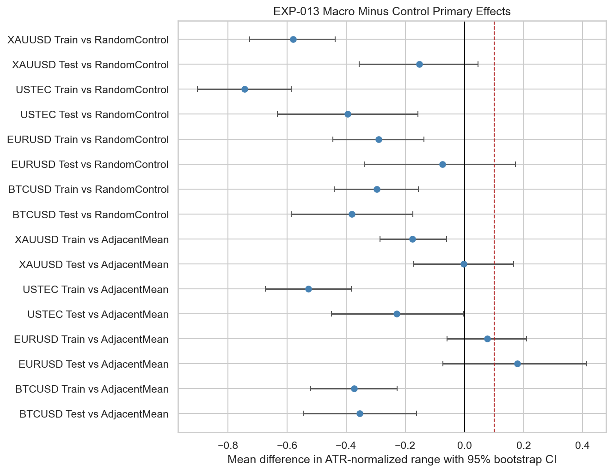
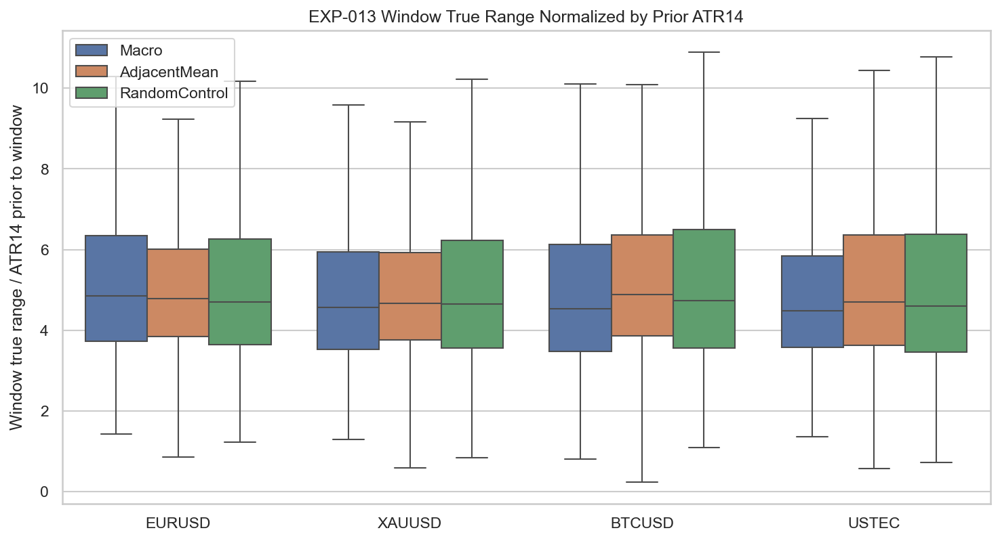
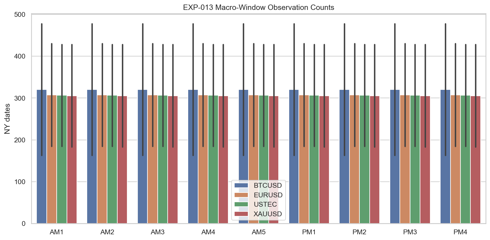

# Experiment Report: EXP-013 - NY Macro Window Characterization

## Status: REFUTED

**Date**: 2026-05-24  
**Instruments**: EURUSD, XAUUSD, BTCUSD, USTEC  
**Data Views / Feature Categories**: 1-minute Time Bars, NY Macro Windows, Adjacent Controls, Random Controls

---

## Question

Are predefined NY macro windows statistically different from adjacent and randomized control windows?

## Hypothesis

Predefined NY macro windows have statistically different range, absolute return, sweep frequency, displacement frequency, or forward-return shape than adjacent and randomized control windows on the available instruments.

## Method Summary

The experiment measured fixed EXP-012 macro windows against equal-duration adjacent controls and deterministic same-day session-bounded random controls. The primary metric was window true range normalized by the ATR14 value known before the window start; support required the primary metric to beat both control families on at least 3 of 4 instruments.

## Key Findings

### Finding 1: No Instrument Supports H1

All instrument-level support flags are false. Every instrument fails the train/test and both-control-family support rule.

### Finding 2: Effects Are Mostly Negative or Uncertain

Primary effects are mixed to negative:

| Instrument | Segment | AdjacentMean Mean Diff | RandomControl Mean Diff |
| --- | --- | ---: | ---: |
| BTCUSD | Test | -0.3547 | -0.3804 |
| BTCUSD | Train | -0.3738 | -0.2965 |
| EURUSD | Test | 0.1791 | -0.0742 |
| EURUSD | Train | 0.0769 | -0.2910 |
| USTEC | Test | -0.2300 | -0.3944 |
| USTEC | Train | -0.5281 | -0.7439 |
| XAUUSD | Test | -0.0026 | -0.1532 |
| XAUUSD | Train | -0.1757 | -0.5790 |

### Finding 3: Sample Coverage Is Adequate

The refutation is not caused by insufficient macro-window counts. Macro date counts are available in both train and test for all instruments: BTCUSD `478/163`, EURUSD `430/185`, USTEC `428/185`, and XAUUSD `428/183`.

## Conclusion

**Hypothesis REFUTED.**

The fixed macro windows do not show the required ATR-normalized range difference versus both adjacent and randomized controls. The strongest positive EURUSD test medians do not survive the uncertainty criteria or train/test consistency requirement.

## Limitations

- Controls are active-session bounded but not matched by macro-window family.
- Secondary metrics are descriptive and cannot overturn the primary gate failure.
- This result applies to the predeclared fixed windows, not to optimized or alternative window definitions.

## Recommended Next Experiments

1. **EXP-015**: Characterize prior high/low sweep reversal behavior directly.
2. Treat macro-window context as an interaction question later, not as a standalone H1 range expansion result.

## Artifacts

| Artifact | Path |
|----------|------|
| Scope | [scope.md](scope.md) |
| Analysis Plan | [analysis-plan.md](analysis-plan.md) |
| Code | [code/](code/) |
| Audit | [audit.md](audit.md) |
| Results | [results.md](results.md) |
| Governance Reviews | [governance/](governance/) |
| Plots | [plots/](plots/) |
