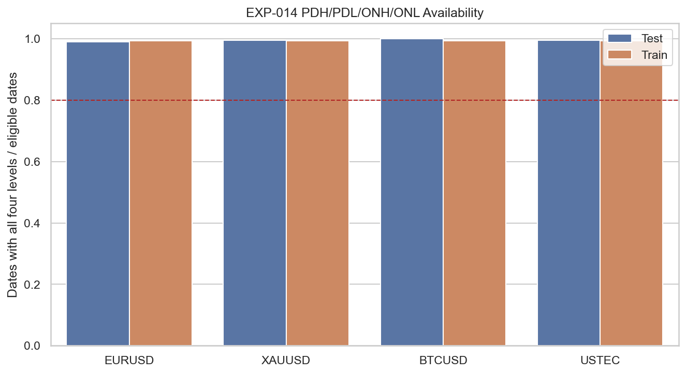
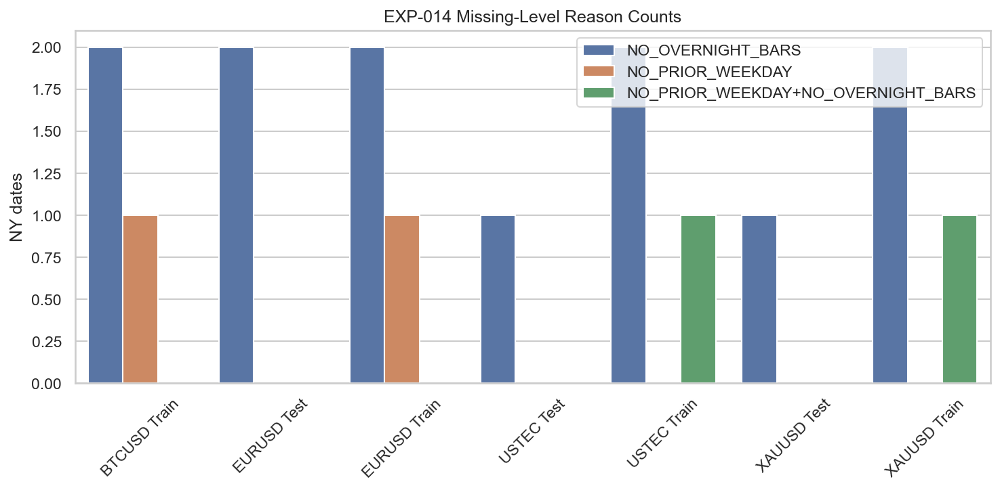

# Experiment Report: EXP-014 - PDH PDL ONH ONL Liquidity Level Reproducibility

## Status: SUPPORTED

**Date**: 2026-05-24  
**Instruments**: EURUSD, XAUUSD, BTCUSD, USTEC  
**Data Views / Feature Categories**: 1-minute Time Bars, Liquidity Levels

---

## Question

Can previous-day and overnight high/low liquidity levels be computed reproducibly on the available instruments?

## Hypothesis

Previous-day and overnight high/low liquidity levels can be computed reproducibly from available time bars without exchange-calendar or preferred-data assumptions that are absent from the repository.

## Method Summary

The experiment loaded only the holdout-excluded analysis set for each instrument, converted `CloseTime` to New York time, and computed PDH/PDL from the prior observed weekday NY date plus ONH/ONL from 17:00 NY on the prior calendar date through 09:30 NY on the event date. It classified missing reasons, checked train/test availability thresholds, and reran the computation in reversed instrument order to verify deterministic equality.

## Key Findings

### Finding 1: All Instruments Pass Level Readiness

All four instruments passed readiness. `DeterministicRerunEqual=True`, train/test rows are present for every instrument, and all segment thresholds pass.

### Finding 2: Availability Is Well Above the Threshold

Train/test all-level availability is high across the board:

| Instrument | Train | Test |
| --- | ---: | ---: |
| BTCUSD | 475/478 = 0.994 | 163/163 = 1.000 |
| EURUSD | 427/430 = 0.993 | 183/185 = 0.989 |
| USTEC | 425/428 = 0.993 | 184/185 = 0.995 |
| XAUUSD | 425/428 = 0.993 | 182/183 = 0.995 |

## Conclusion

**Hypothesis SUPPORTED.**

The approved PDH/PDL and ONH/ONL definitions are reproducible and sufficiently available for downstream sweep studies on the current time-bar datasets. EXP-015 can inherit these level definitions and missing-level rules unchanged.

## Limitations

- This is a definition-readiness experiment, not a sweep outcome test.
- ONH/ONL are derived from observed bars and documented NY-time boundaries, not exchange-native session metadata.
- Transaction-cost data is still unavailable and must be handled by proxy scenarios in future outcome experiments.

## Recommended Next Experiments

1. **EXP-015**: Test whether prior-day and overnight high/low sweeps show measurable failed-breakout behavior.

## Artifacts

| Artifact | Path |
|----------|------|
| Scope | [scope.md](scope.md) |
| Analysis Plan | [analysis-plan.md](analysis-plan.md) |
| Code | [code/](code/) |
| Audit | [audit.md](audit.md) |
| Results | [results.md](results.md) |
| Governance Reviews | [governance/](governance/) |
| Plots | [plots/](plots/) |
