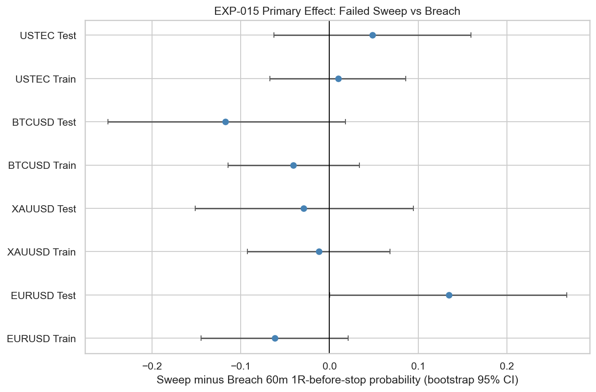
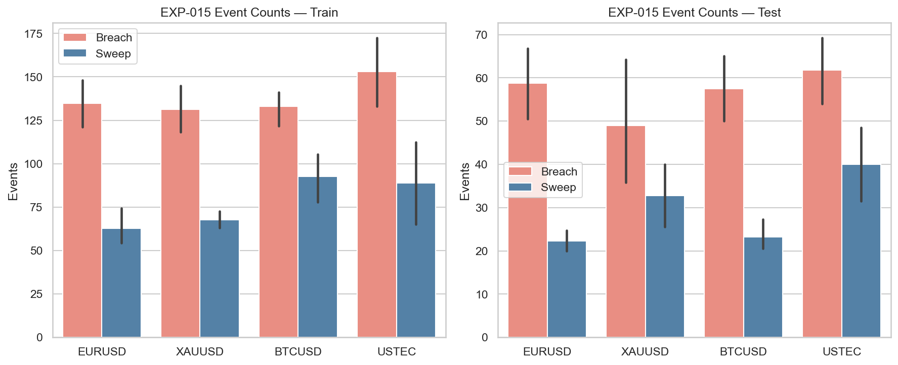
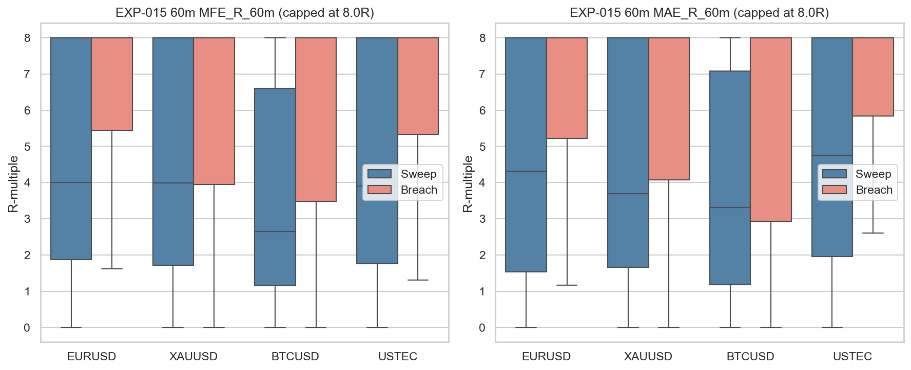

# Experiment Report: EXP-015 - Prior High Low Sweep Reversal Behavior

## Status: REFUTED

**Date**: 2026-05-25
**Instruments**: EURUSD, XAUUSD, BTCUSD, USTEC
**Data Views / Feature Categories**: 1-minute time bars, PDH/PDL, ONH/ONL, sweep and breach events

---

## Question

Do prior-day and overnight high/low sweeps show measurable failed-breakout behavior?

## Hypothesis

Failed breakouts beyond PDH/PDL or ONH/ONL show measurable opposite-direction behavior compared with non-failed breaches, using real time-bar prices and predeclared risk units.

## Method Summary

The experiment detected first-touch PDH/PDL/ONH/ONL events in the holdout-excluded analysis set, classifying each as either a failed sweep or non-failed breach. It then measured real-price MFE, MAE, time-to-hit, and 1R/2R hit outcomes over 30, 60, and 120 minutes, with the primary comparison defined as sweep minus breach 60-minute 1R-before-stop probability.

## Key Findings

### Finding 1: Primary support appears on only one instrument

The test-segment primary effect supports the hypothesis only for EURUSD. EURUSD Test has sweep hit rate `0.607` versus breach hit rate `0.472`, with bootstrap diff `+0.134` and CI `[0.001, 0.267]`.

The other instruments fail the support rule: XAUUSD Test diff `-0.029`, BTCUSD Test diff `-0.117`, and USTEC Test diff `+0.048` with a CI crossing zero.

### Finding 2: Sample size is adequate

The result is interpretable because all instruments pass the event-count gate. Test sweep counts are EURUSD `89`, XAUUSD `131`, BTCUSD `93`, and USTEC `160`; EURUSD and BTCUSD pass through the balanced high/low exception.

### Finding 3: Secondary outcomes are mixed

Test-segment sweeps have lower 60-minute MFE and lower MAE than breaches across all instruments. Hit2R outcomes are mixed: EURUSD sweeps are better, XAUUSD and BTCUSD sweeps are worse, and USTEC is roughly tied. This does not overturn the predefined primary failure.

## Conclusion

**Hypothesis REFUTED.**

The sweep-only H2 claim does not hold across the available instrument set. The support criterion required at least 3 instruments with adequate event counts and positive confidence intervals excluding zero; EXP-015 finds only EURUSD Test. Since event counts are adequate, this is a substantive negative result rather than a sample-size failure.

EXP-015 should not be used as evidence that PDH/PDL or ONH/ONL sweeps alone provide robust failed-breakout edge. Later ICT component experiments may still test whether macro context, premium/discount filters, displacement, IFVG, or breaker confirmation improve the weak sweep-only baseline.

## Limitations

- Uses only 1-minute OHLC data; no tick, bid/ask, spread, commission, or slippage data.
- Price precision is inferred from observed close-to-close increments.
- Bootstrap intervals resample events and do not fully model temporal clustering.
- Sweep-only results do not answer full ICT model viability.

## Implications for Future Research

- Treat sweep-only behavior as a weak standalone component.
- Continue with EXP-016 only as a new scoped test of macro-window interaction, not as a reinterpretation of EXP-015.
- Require later components to show incremental value rather than assuming sweeps are a strong base signal.

## Recommended Next Experiments

1. **EXP-016**: Test whether sweep outcomes materially differ inside macro windows versus outside macro windows.
2. **EXP-017**: Test whether previous-day midpoint premium/discount filtering improves sweep quality or mainly reduces sample size.

## Artifacts

| Artifact | Path |
|----------|------|
| Scope | [scope.md](scope.md) |
| Analysis Plan | [analysis-plan.md](analysis-plan.md) |
| Code | [code/](code/) |
| Audit | [audit.md](audit.md) |
| Results | [results.md](results.md) |
| Governance Reviews | [governance/](governance/) |
| Result Tables | [results/](results/) |
| Plots | [plots/](plots/) |
