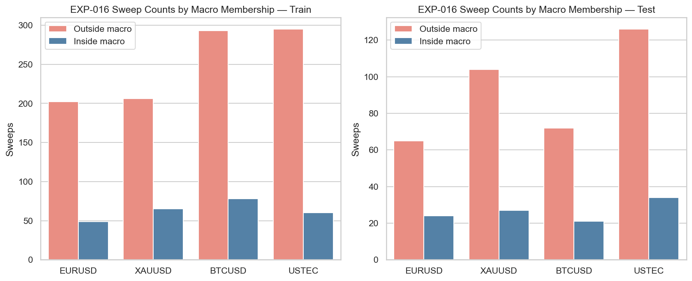
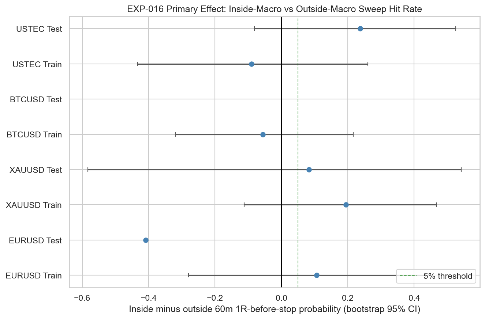
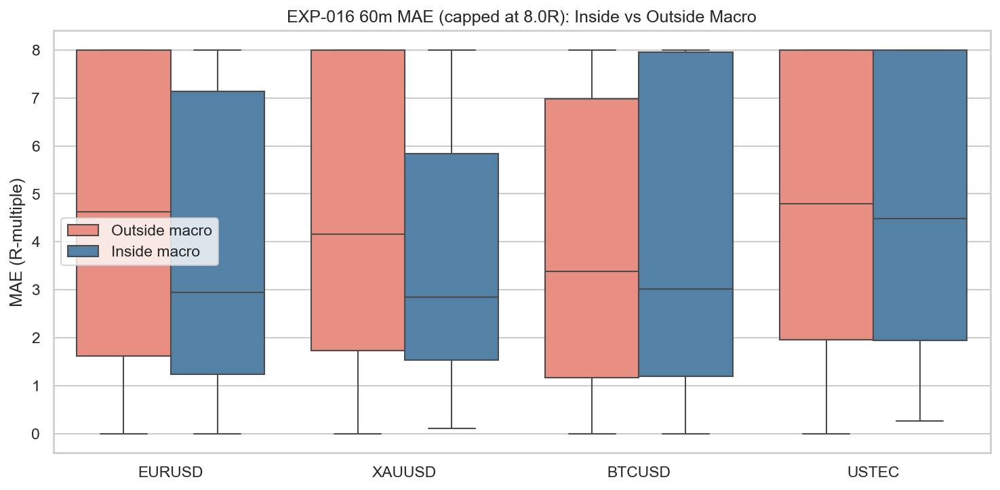

# Experiment Report: EXP-016 - Macro Window Interaction With Sweep Outcomes

## Status: INCONCLUSIVE

**Date**: 2026-05-25  
**Instruments**: EURUSD, XAUUSD, BTCUSD, USTEC  
**Data Views / Feature Categories**: 1-minute time bars, NY macro windows, PDH/PDL and ONH/ONL sweep events

---

## Question

Are sweep outcomes materially different inside macro windows versus outside macro windows?

## Hypothesis

Sweep outcomes inside predefined macro windows are materially different from sweep outcomes outside macro windows after accounting for event count and instrument coverage.

## Method Summary

EXP-016 reused the EXP-015 sweep definition and EXP-012 macro-window labels. It compared inside-window sweeps against outside-window sweeps matched by instrument, side, segment, and NY date, then bootstrapped differences in 60-minute 1R-before-stop probability and median MAE.

## Key Findings

### Finding 1: Coverage is below the event floor

No instrument has enough inside-window sweeps and matched outside-window comparators in both train and test. Test inside sweep counts are EURUSD `24`, XAUUSD `27`, BTCUSD `21`, and USTEC `34`; the floor is `50`.

### Finding 2: The matched outside baseline is very sparse

The same-day matched outside baseline keeps only EURUSD `2`, XAUUSD `4`, BTCUSD `1`, and USTEC `12` test-segment outside sweeps. Matched fractions are `1.4%` to `9.5%` in test.

### Finding 3: Raw effects are descriptive only

All threshold-pass flags are false after applying the inside and matched-outside event floors. USTEC Test has a positive HitDiff (`+0.237`) but its CI crosses zero (`[-0.081, 0.525]`) and the row is non-evaluable. BTCUSD Test has no non-ambiguous matched outside hit observations.

## Conclusion

**Hypothesis INCONCLUSIVE.**

EXP-016 does not provide usable evidence that macro-window context improves or degrades sweep outcomes. The matched control design is methodologically conservative, but it leaves too few events for the predefined decision rule. This result should be interpreted as a coverage failure for this specific interaction test, not as support or refutation of macro-window context.

## Limitations

- Macro windows are narrow and first-touch sweep events are sparse inside them.
- Matching by NY date and side sharply reduces comparator count.
- Event-level bootstrap does not fully model temporal clustering.
- Cost fields are unavailable, so the experiment remains a gross path-behavior study.

## Implications for Future Research

- Do not promote macro-window context as a required filter based on EXP-016.
- Do not delete later ICT component tests solely because EXP-016 is inconclusive.
- Any future macro-context rerun should be scoped as a new experiment with a less sparse control design.

## Recommended Next Experiments

1. **EXP-017**: Test whether previous-day midpoint premium/discount filtering improves sweep quality or mainly reduces sample size.
2. **Future macro-context rerun**: If needed, predeclare a broader matched-control or stratified-control design to preserve event counts.

## Artifacts

| Artifact | Path |
|----------|------|
| Scope | [scope.md](scope.md) |
| Analysis Plan | [analysis-plan.md](analysis-plan.md) |
| Code | [code/](code/) |
| Audit | [audit.md](audit.md) |
| Results | [results.md](results.md) |
| Governance Reviews | [governance/](governance/) |
| Result Tables | [results/](results/) |
| Plots | [plots/](plots/) |
