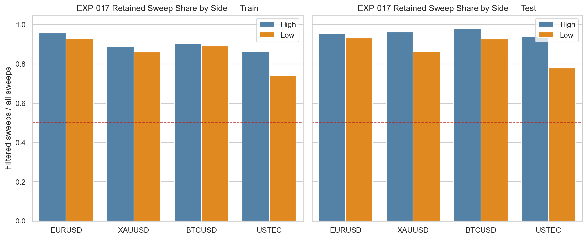
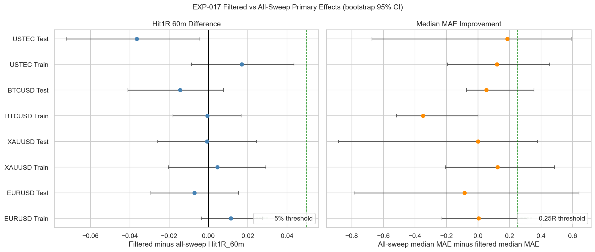
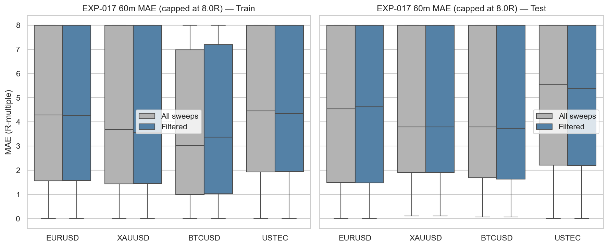

# Experiment Report: EXP-017 - Premium Discount Filter Impact on Sweep Quality

## Status: INCONCLUSIVE

**Date**: 2026-05-25
**Instruments**: EURUSD, XAUUSD, BTCUSD, USTEC
**Data Views / Feature Categories**: 1-minute time bars, prior-day midpoint, PDH/PDL sweep events

---

## Question

Does previous-day midpoint premium/discount filtering improve sweep quality or only reduce sample size?

## Hypothesis

A previous-day midpoint premium/discount filter improves sweep quality enough to justify the sample-size cost.

## Method Summary

EXP-017 reused approved EXP-015 sweep events and EXP-014 prior-day level definitions. It labeled each sweep as passing or failing the prior-day midpoint filter, then compared filtered versus unfiltered 60-minute real-price outcomes using nested bootstrap differences for `Hit1R_60m` mean and `MAE_R_60m` median.

## Key Findings

### Finding 1: The filter is low-cost but not high-value

The midpoint filter retains most test-segment sweeps on every instrument: EURUSD `94.4%`, XAUUSD `92.4%`, BTCUSD `95.7%`, and USTEC `86.2%`.

Despite that high retention, no instrument reaches the predeclared `+5pp` `Hit1R_60m` improvement threshold.

### Finding 2: Quality improvement does not generalize

Test hit-rate differences (`filtered - all sweeps`) are EURUSD `-0.007`, XAUUSD `-0.001`, BTCUSD `-0.014`, and USTEC `-0.036`. Median-MAE improvements are EURUSD `-0.086R`, XAUUSD `0.000R`, BTCUSD `+0.052R`, and USTEC `+0.185R`, with all confidence intervals too wide to support the scoped pass rule.

The MAE distribution plot shows some pruning on BTCUSD and USTEC, but not enough to justify the filter as a robust improvement.

## Conclusion

**Hypothesis INCONCLUSIVE.**

The midpoint filter is not supported as a reliable improvement. It retains a large share of sweeps but fails to produce the required hit-rate or MAE gains on any instrument. Because several intervals remain wide and a few MAE point estimates are mildly positive, the result is better treated as inconclusive than as a hard refutation.

## Limitations

- Uses the EXP-015 sweep baseline only; no alternative location filters are tested.
- Uses 1-minute OHLC data only; no spread, commission, slippage, or bid/ask fields are available.
- Bootstrap intervals resample events and do not fully model temporal clustering.

## Implications for Future Research

- The prior-day midpoint should not be promoted as a required ICT location filter from current evidence.
- Any location-filter follow-up should test one tighter, predeclared alternative rather than introducing several related filters at once.

## Recommended Next Experiments

1. **New location-filter follow-up**: If reopened, test exactly one stricter location rule as a fresh scope.
2. **Cross-component consolidation**: Interpret EXP-017 alongside EXP-015 through EXP-019 before adding more ICT confirmation layers.

## Artifacts

| Artifact | Path |
|----------|------|
| Scope | [scope.md](scope.md) |
| Analysis Plan | [analysis-plan.md](analysis-plan.md) |
| Code | [code/](code/) |
| Audit | [audit.md](audit.md) |
| Results | [results.md](results.md) |
| Governance Reviews | [governance/](governance/) |
| Result Tables | [results/](results/) |
| Plots | [plots/](plots/) |
