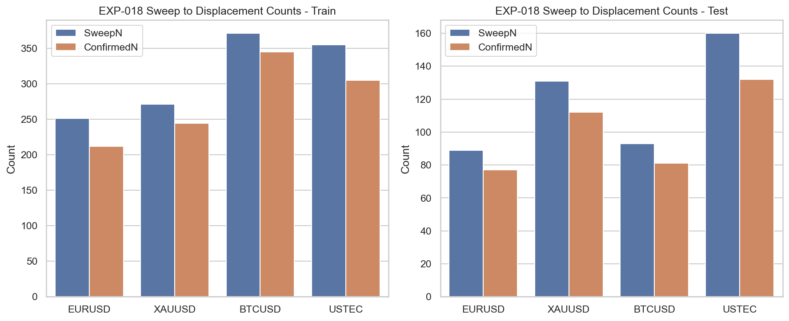
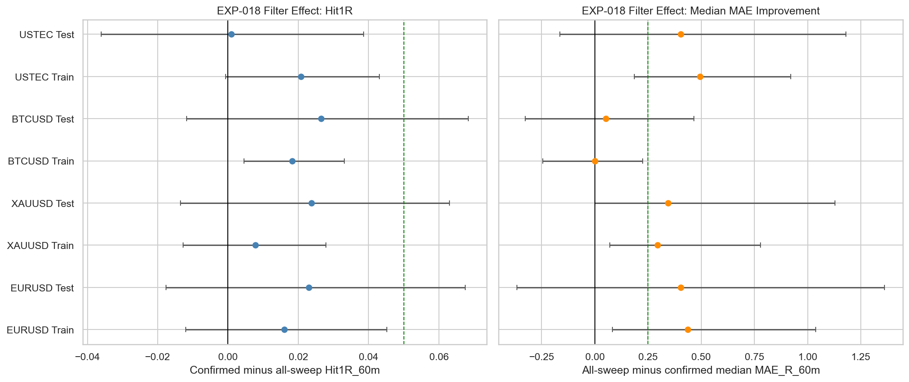
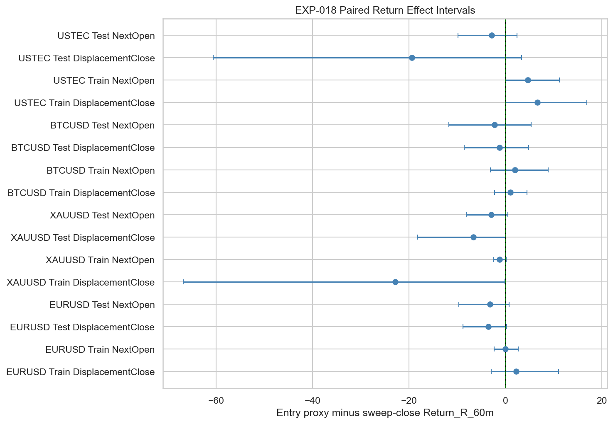
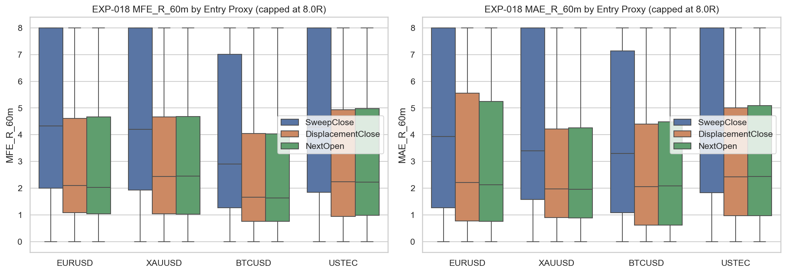

# Experiment Report: EXP-018 - Displacement Confirmation Added to Sweeps

## Status: INCONCLUSIVE

**Date**: 2026-05-25
**Instruments**: EURUSD, XAUUSD, BTCUSD, USTEC
**Data Views / Feature Categories**: 1-minute time bars, PDH/PDL and ONH/ONL sweep events, displacement confirmation

---

## Question

Does adding deterministic displacement improve sweep-only outcomes?

## Hypothesis

Adding a deterministic displacement candle after a sweep improves sweep-only outcomes enough to offset delayed confirmation and fewer signals.

## Method Summary

EXP-018 reused EXP-015 sweep events, searched the next 10 bars for the first candle matching the scoped displacement rule, and then evaluated real-price 60-minute outcomes from sweep-close, displacement-close, and next-open entry proxies. The primary test compared displacement-confirmed sweeps against the full EXP-015 sweep population with a nested-subset bootstrap.

## Key Findings

### Finding 1: Confirmation keeps most events but does not pass the primary thresholds

Test confirmed-sweep retention remains high: EURUSD `86.5%`, XAUUSD `85.5%`, BTCUSD `87.1%`, and USTEC `82.5%`. All four instruments pass the event floor.

Yet no test instrument clears the interval-based support rule versus the full sweep population.

### Finding 2: Waiting for displacement can damage entry quality

On the matched confirmed-event subset, waiting for displacement often worsens results versus entering at sweep close. EURUSD Test paired hit-rate difference is `-0.159`, and XAUUSD Test is `-0.140`, both with confidence intervals excluding zero on the negative side.

The raw MFE/MAE distributions do not overturn that delay-cost signal.

## Conclusion

**Hypothesis INCONCLUSIVE.**

Displacement confirmation does not earn promotion as a validated improvement over sweep-only behavior. The retained subset sometimes looks modestly cleaner than the full sweep population, but none of the test intervals clears the scoped thresholds and the paired delay-cost diagnostic is often negative.

## Limitations

- Uses one scoped displacement definition only; no alternative body/close-location variants are tested.
- Uses 1-minute OHLC data only; no cost modeling is available.
- One raw `NextOpen` event has zero risk and is excluded from effect calculations, but it does not affect the verdict.

## Implications for Future Research

- The H3 displacement path remains unproven under the simplest deterministic candle/body rule.
- Any continuation of H3 work should compare against both the sweep-only baseline and the completed EXP-019 swing-break variant rather than assuming displacement is the default confirmation.

## Recommended Next Experiments

1. **Consolidated H3 assessment**: Compare EXP-018 and EXP-019 before defining any new confirmation scope.
2. **New stricter confirmation follow-up**: If reopened, test one tighter confirmation rule with predeclared regime limits as a new experiment.

## Artifacts

| Artifact | Path |
|----------|------|
| Scope | [scope.md](scope.md) |
| Analysis Plan | [analysis-plan.md](analysis-plan.md) |
| Code | [code/](code/) |
| Audit | [audit.md](audit.md) |
| Results | [results.md](results.md) |
| Governance Reviews | [governance/](governance/) |
| Result Tables | [results/](results/) |
| Plots | [plots/](plots/) |
