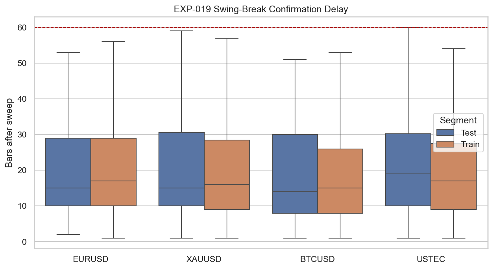
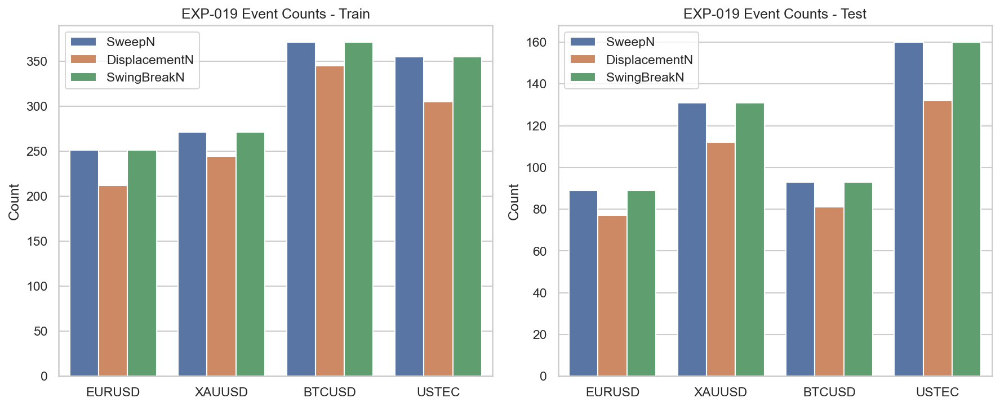
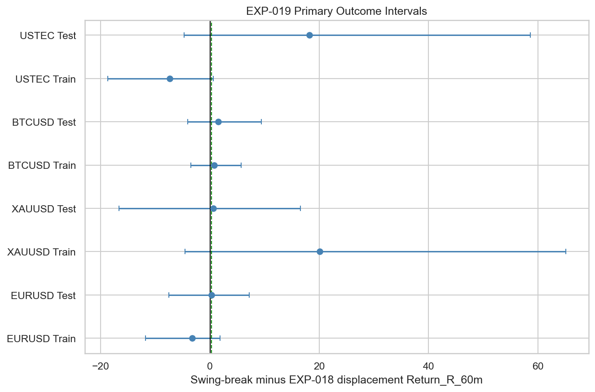
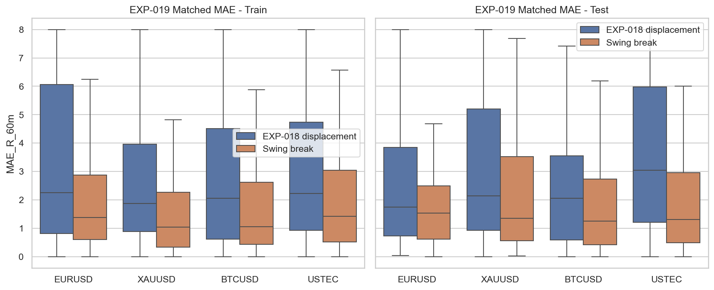

# Experiment Report: EXP-019 - Micro Swing Break Confirmation After Sweep

## Status: INCONCLUSIVE

**Date**: 2026-05-25
**Instruments**: EURUSD, XAUUSD, BTCUSD, USTEC
**Data Views / Feature Categories**: 1-minute time bars, PDH/PDL and ONH/ONL sweep events, causal micro swing breaks

---

## Question

Does requiring a micro swing break after sweep improve signal quality beyond simpler displacement?

## Hypothesis

A micro swing break after a sweep improves signal quality beyond the simpler displacement definition.

## Method Summary

EXP-019 detected two-left/two-right swing pivots, made them usable only at the causal confirmation bar, and then searched for the first post-sweep close through the latest usable opposite-side swing. It compared those swing-break events with the completed EXP-018 displacement-close baseline using paired bootstrap differences for 60-minute return and median MAE.

## Key Findings

### Finding 1: The causal swing-break definition is usable

All four instruments meet the matched event floor in test: EURUSD `77`, XAUUSD `112`, BTCUSD `81`, and USTEC `132`. No instrument is disqualified by the scoped excessive-delay rule.

The event-count comparison shows that the swing-break variant remains large enough to study even after causal confirmation.

### Finding 2: The variant does not decisively beat EXP-018 displacement

No test instrument clears the interval-based support thresholds. XAUUSD and USTEC show positive MAE point estimates, but their `CI95-low` values remain below the required `0.25R` pass bar.

Matched MAE distributions show some directional improvement, but not enough to convert the result into support.

## Conclusion

**Hypothesis INCONCLUSIVE.**

The causal swing-break variant is reproducible and not excessively slow, but it does not demonstrate a validated improvement over EXP-018 displacement under the predeclared paired-interval criteria. The result is better treated as inconclusive than supportive because none of the test intervals clears the required threshold.

## Limitations

- The comparison is only against the completed EXP-018 displacement-close baseline; it does not revisit sweep-only or combine both confirmation rules.
- Uses 1-minute OHLC data only; no execution-cost data is available.
- Audit note: one BTCUSD cross-segment case is grouped under the sweep segment in the generated tables, but the measured effect on the verdict is immaterial.

## Implications for Future Research

- The H3 swing-break path remains unresolved, not validated.
- Future H3 work should avoid stacking more confirmation layers until the project consolidates what EXP-018 and EXP-019 jointly imply about displacement-style confirmation.

## Recommended Next Experiments

1. **H3 consolidation follow-up**: Summarize EXP-018 and EXP-019 together before designing any new confirmation rule.
2. **New restricted-variant experiment**: If reopened, test one narrower swing-break regime or one stricter swing definition as a fresh scope.

## Artifacts

| Artifact | Path |
|----------|------|
| Scope | [scope.md](scope.md) |
| Analysis Plan | [analysis-plan.md](analysis-plan.md) |
| Code | [code/](code/) |
| Audit | [audit.md](audit.md) |
| Results | [results.md](results.md) |
| Governance Reviews | [governance/](governance/) |
| Result Tables | [results/](results/) |
| Plots | [plots/](plots/) |
