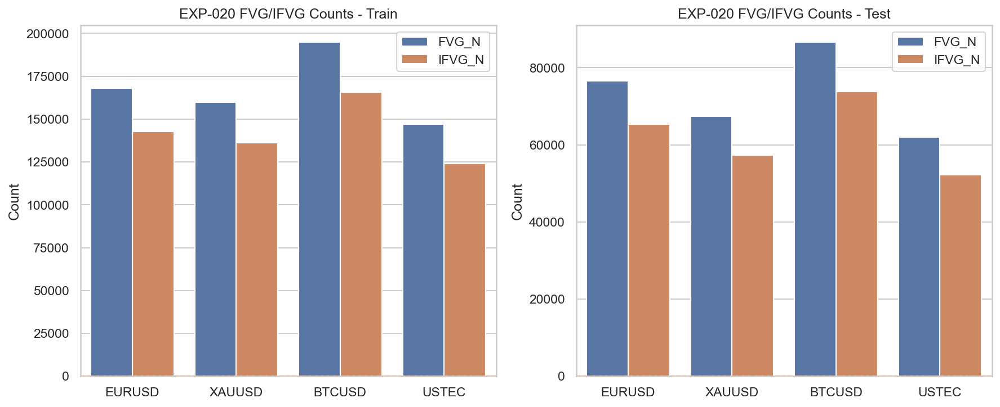
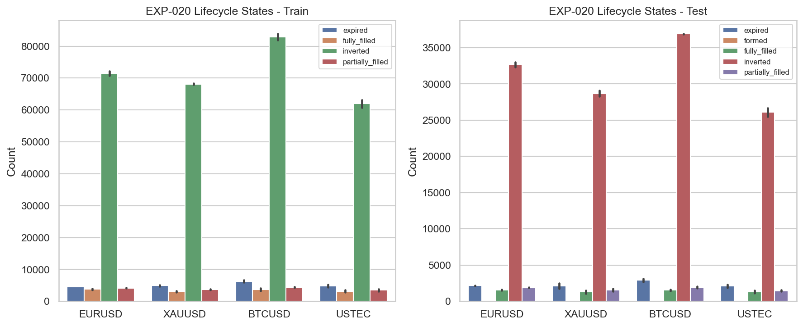
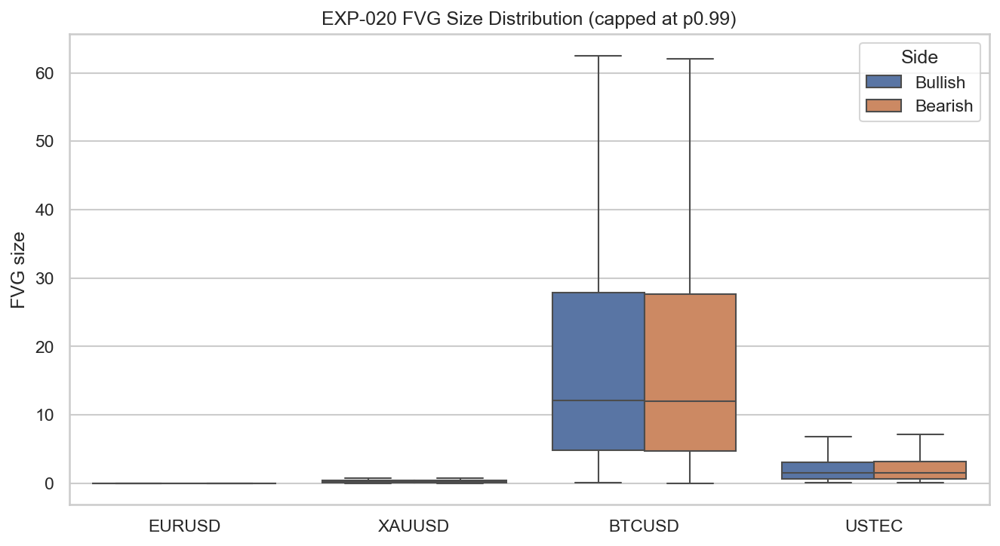

# Experiment Report: EXP-020 - FVG IFVG Detection Reproducibility

## Status: INCONCLUSIVE

**Date**: 2026-05-25
**Instruments**: EURUSD, XAUUSD, BTCUSD, USTEC
**Data Views / Feature Categories**: 1-minute time bars, FVG zones, IFVG lifecycle states

---

## Question

Can FVG and IFVG zones be detected reproducibly with stable sample sizes?

## Hypothesis

Three-candle FVGs and close-through IFVG inversions can be detected reproducibly with stable sample sizes on available time bars.

## Method Summary

EXP-020 applied the scoped three-candle FVG rules with a minimum-size floor of `max(price_precision_step, 0.02 * ATR14Prior)`, tracked each zone for 120 bars, and classified lifecycle states including close-through inversion. It then checked reproducibility through fresh-reload and shuffled-resort digest invariance and evaluated downstream readiness through FVG/IFVG count floors plus an IFVG base-rate sanity gate.

## Key Findings

### Finding 1: Detection is deterministic

All four instruments pass both reproducibility checks. Fresh reloads and shuffled-then-resorted inputs produce identical FVG identity digests.

This supports trust in the mechanics of the zone detector.

### Finding 2: IFVG inversion is too common to be selective

Every instrument and segment clears the count floors, but every IFVG base rate is approximately `0.84-0.85`, far above the `0.50` tautology threshold.

That means inversion is behaving as a common lifecycle outcome rather than a discriminating event under the current rule set. The size distribution confirms that this is happening across a very large event population, not just a sparse edge case.

## Conclusion

**Hypothesis INCONCLUSIVE.**

The experiment supports the narrow claim that FVG and IFVG mechanics are reproducible and abundant on the available 1-minute data, but it does not clear the downstream readiness gate for IFVG-entry work. Because inversion happens on most detected FVGs, the current IFVG rule is not selective enough to hand forward unchanged to EXP-021.

## Limitations

- Uses a fixed 120-bar lifecycle and a fixed ATR/price-step size floor; any change would require a new scope.
- Makes no profitability claims and uses 1-minute OHLC data only.
- Audit note: reproducibility hashes are sampled on the first 50,000 bars per instrument for runtime control, though the full-run count tables are internally consistent.

## Implications for Future Research

- The zone detector itself is usable, but the current IFVG definition is not ready as a confirmation signal.
- EXP-021 should not proceed under these exact rules.

## Recommended Next Experiments

1. **New IFVG selectivity prerequisite**: Tighten one of size, lifecycle, or inversion rules in a fresh scope before reopening IFVG entry-quality work.
2. **Blocked handoff**: Do not run EXP-021 unchanged; its prerequisite readiness gate is not met.

## Artifacts

| Artifact | Path |
|----------|------|
| Scope | [scope.md](scope.md) |
| Analysis Plan | [analysis-plan.md](analysis-plan.md) |
| Code | [code/](code/) |
| Audit | [audit.md](audit.md) |
| Results | [results.md](results.md) |
| Governance Reviews | [governance/](governance/) |
| Result Tables | [results/](results/) |
| Plots | [plots/](plots/) |
