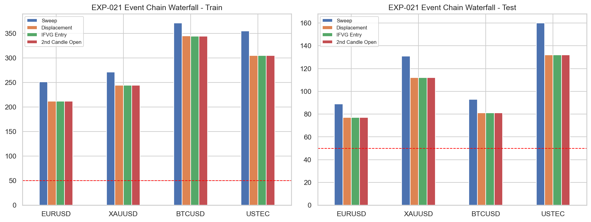

# Experiment Report: EXP-021 - IFVG Confirmation Entry Quality

## Status: REFUTED

**Date**: 2026-05-26
**Instruments**: EURUSD, XAUUSD, BTCUSD, USTEC
**Data Views / Feature Categories**: 1-minute time bars, sweep and displacement event chains, IFVG confirmation timing

---

## Question

Does IFVG confirmation improve entry quality enough to offset later entry timing and fewer signals?

## Hypothesis

IFVG confirmation improves entry quality enough to offset later entry timing and fewer signals.

## Method Summary

EXP-021 reused EXP-015 sweep events, the fixed EXP-018 displacement prerequisite, and the frozen EXP-020 IFVG rule to compare sweep-close, displacement-close, IFVG-close, and second-candle-open entries on the same event chains. After the revision, any delayed entry that kept the inherited sweep stop but had `Risk1R` below the original EXP-015 sweep buffer was marked risk-infeasible and removed from R-based summaries while remaining in chain-retention diagnostics.

## Key Findings

### Finding 1: The rerun is trustworthy, and the hypothesis still fails

The inherited-risk feasibility guard removes the prior denominator-collapse issue cleanly. `53` delayed-entry rows are filtered out of `6,030`, and none contributes to the stored R-based outcomes.

The verdict remains negative after that fix: all four instruments meet the feasible-event floor, but none passes the predeclared bootstrap support rule.

### Finding 2: IFVG confirmation barely filters the displacement set

IFVG counts are identical to displacement counts on `7/8` instrument-segment rows, with only BTCUSD Train dropping from `345` to `344`.

That means the experiment is mostly paying entry delay without earning meaningful selectivity. The IFVG-close return means are broadly weak or negative in test: EURUSD `-0.823R`, XAUUSD `-0.551R`, BTCUSD `-0.055R`, and USTEC `-0.524R`.

### Finding 3: Later entry does not rescue the IFVG path

The second-candle-open diagnostic also fails to create a broad improvement. Some MAE and drawdown measures improve, but the test-segment return evidence does not clear the scoped support rule on any instrument.

The risk-distance plot shows why the denominator fix mattered, but it does not change the substantive story: IFVG timing under this frozen rule set is not earning its keep.

## Conclusion

**Hypothesis REFUTED.**

Under the scoped IFVG rule set, confirmation does not improve entry quality enough to justify the added delay. The rerun resolves the numerical trust issue and leaves a substantive negative result: `0/4` instruments pass despite adequate feasible counts everywhere.

## Limitations

- The experiment intentionally uses the frozen EXP-020 IFVG rule as a consequence check, even though EXP-020 already showed the rule is not very selective.
- Uses one fixed stop convention inherited from EXP-015 and one fixed displacement prerequisite from EXP-018.
- Uses 1-minute OHLC prices only and no execution-cost model.

## Implications for Future Research

- The broad H4 IFVG-confirmation path is not justified under the current rule set.
- Any future IFVG follow-up must begin by redefining the prerequisite confirmation event, not by reinterpreting this result.

## Recommended Next Experiments

1. **New IFVG prerequisite scope**: Tighten one explicit IFVG selectivity rule before reopening entry-quality work.
2. **Component ablation path**: Carry this refutation forward into EXP-026 rather than treating IFVG as a likely positive building block.

## Artifacts

| Artifact | Path |
|----------|------|
| Scope | [scope.md](scope.md) |
| Analysis Plan | [analysis-plan.md](analysis-plan.md) |
| Code | [code/](code/) |
| Audit | [audit.md](audit.md) |
| Results | [results.md](results.md) |
| Governance Reviews | [governance/](governance/) |
| Result Tables | [results/](results/) |
| Plots | [plots/](plots/) |
