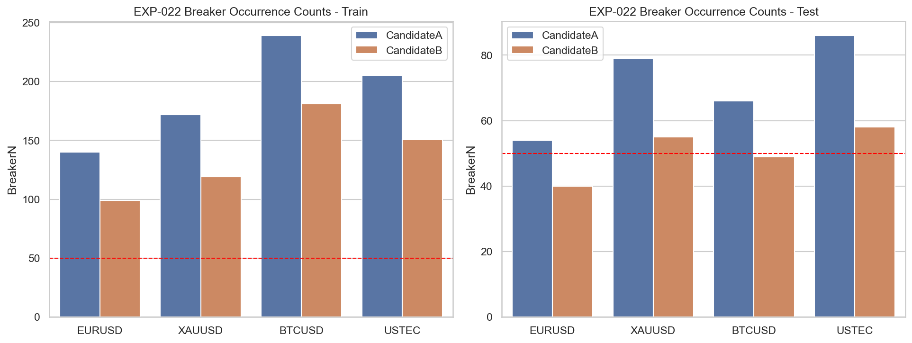
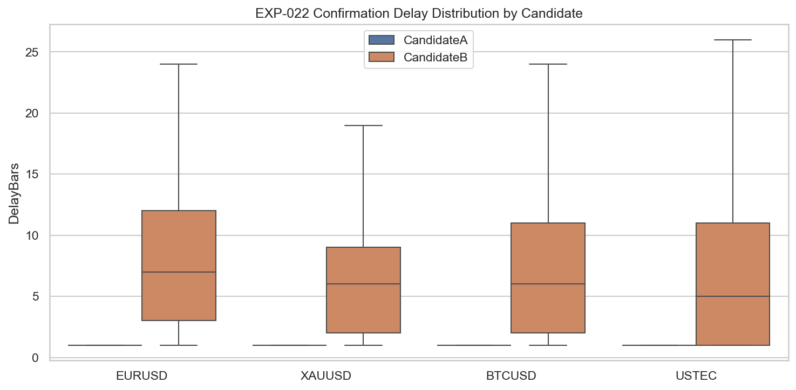

# Experiment Report: EXP-022 - Objective Breaker Candidate Reproducibility

## Status: SUPPORTED

**Date**: 2026-05-26
**Instruments**: EURUSD, XAUUSD, BTCUSD, USTEC
**Data Views / Feature Categories**: 1-minute time bars, displacement-confirmed sweep events, breaker candidate definitions

---

## Question

Which objective breaker candidate is reproducible enough for testing?

## Hypothesis

At least one objective breaker candidate can be defined reproducibly with enough occurrences to justify outcome testing.

## Method Summary

EXP-022 evaluated two predeclared breaker definitions after the fixed EXP-018 displacement prerequisite: Candidate A as the last-opposite-candle order-block proxy, and Candidate B as the causal swing-break variant. The experiment compared deterministic rerun equality, ambiguity rates, and train/test occurrence floors, then selected at most one candidate using the predeclared non-profitability rule.

## Key Findings

### Finding 1: Candidate A is ready for downstream testing

Candidate A is reproducible on all four instruments and clears the `>= 50` event floor in every train and test segment.

That makes Candidate A the only breaker definition that satisfies the scoped readiness gate for a broad follow-up outcome experiment.

### Finding 2: Candidate B is deterministic but too sparse in test

Candidate B reproduces exactly across reruns, but it falls below the test floor on EURUSD (`40`) and BTCUSD (`49`).

So the blocker is not ambiguity or instability. It is insufficient test-segment availability under the current floor rule.

## Conclusion

**Hypothesis SUPPORTED.**

The scoped question was whether at least one objective breaker candidate could be defined reproducibly with enough occurrences to justify later outcome testing. Candidate A satisfies that requirement cleanly, while Candidate B does not. The practical result is that EXP-023 should use Candidate A only.

## Limitations

- This experiment does not evaluate expectancy, drawdown, or any other trade-quality metric.
- The selection rule is tied to the fixed EXP-018 displacement prerequisite and the `>= 50` event floor.
- Candidate B may still have niche value in a narrower scope despite failing the broad readiness gate here.

## Implications for Future Research

- The H5 prerequisite gate is now satisfied for Candidate A.
- Candidate B should not be mixed back into EXP-023 without a fresh scope that explicitly accepts lower test counts.

## Recommended Next Experiments

1. **EXP-023 rerun (revised)**: Use Candidate A only, after the downstream R-denominator issue is resolved.
2. **Candidate B narrow-scope follow-up**: Evaluate the swing-break variant only if a future scope explicitly targets lower-frequency confirmations.

## Artifacts

| Artifact | Path |
|----------|------|
| Scope | [scope.md](scope.md) |
| Analysis Plan | [analysis-plan.md](analysis-plan.md) |
| Code | [code/](code/) |
| Audit | [audit.md](audit.md) |
| Results | [results.md](results.md) |
| Governance Reviews | [governance/](governance/) |
| Result Tables | [results/](results/) |
| Plots | [plots/](plots/) |
