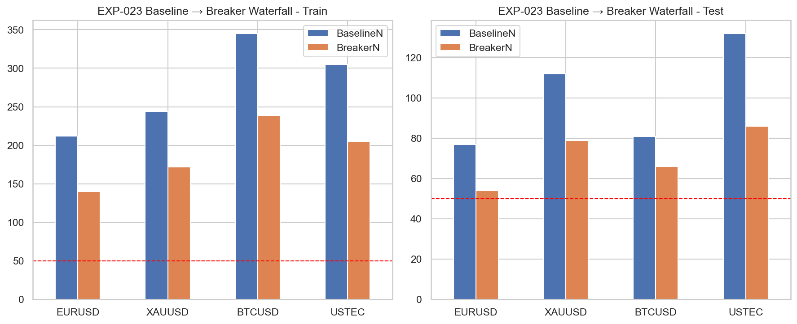

# Experiment Report: EXP-023 - Breaker Confirmation Trade Quality

## Status: REFUTED

**Date**: 2026-05-26
**Instruments**: EURUSD, XAUUSD, BTCUSD, USTEC
**Data Views / Feature Categories**: 1-minute time bars, displacement-confirmed sweep events, Candidate A breaker confirmation

---

## Question

Does the approved breaker confirmation improve trade quality beyond the predeclared baseline?

## Hypothesis

One objective breaker confirmation improves trade quality beyond a predeclared pre-breaker baseline.

## Method Summary

EXP-023 loaded the fixed displacement baseline and the single EXP-022-approved breaker candidate, Candidate A, then compared baseline-versus-breaker outcomes in R-space using real 1-minute time-bar prices. After the revision, any baseline or breaker row with inherited `Risk1R` below the original EXP-015 sweep buffer was marked risk-infeasible and excluded from R-based summaries while remaining visible in retention diagnostics.

## Key Findings

### Finding 1: The rerun is trustworthy, but the broad H5 claim still fails

The inherited-risk feasibility guard removes the prior denominator-collapse issue cleanly. Only `24` rows are filtered from `2,549`, and none contributes to the stored R-based outcomes.

All breaker train/test rows still clear the feasible-event floor, so the hypothesis now fails on substance rather than on broken normalization.

### Finding 2: Candidate A improves one instrument clearly, not the full basket

USTEC is the strongest case. Test breaker return is `+1.756R` versus baseline `-2.414R`, and both return and drawdown-adjusted bootstrap intervals are positive while train return is not worse.

But the scoped support rule requires that pattern on at least three instruments. EURUSD and XAUUSD improve in point estimate and MAE, yet their test return evidence remains too uncertain. BTCUSD is effectively flat.

### Finding 3: The main consistent effect is path improvement, not broad expectancy improvement

MAE generally improves or stays controlled under the breaker filter, and the distribution plot shows tighter downside tails on several instruments.

Still, that path cleanup does not translate into the broad cross-instrument return evidence needed by the scope. Retention remains reasonable, but the quality gain is not portable enough.

## Conclusion

**Hypothesis REFUTED.**

Candidate A is a legitimate, reproducible breaker definition and does help in USTEC, but it does not support the broader claim that breaker confirmation improves trade quality across the four-instrument basket. The rerun resolves the trust issue and leaves a substantive negative result: `1/4` instruments pass.

## Limitations

- Tests only the single EXP-022-approved breaker candidate.
- Uses a fixed displacement baseline and a fixed inherited-stop convention.
- Uses 1-minute OHLC prices only and no execution-cost model.

## Implications for Future Research

- The broad H5 path should not be treated as validated.
- Breaker confirmation may still warrant a narrower, explicitly scoped follow-up on the instruments where it looked strongest.

## Recommended Next Experiments

1. **Narrow breaker follow-up**: Re-scope breaker testing around USTEC or another explicitly predeclared subset if the concept remains important.
2. **Ablation carry-forward**: Treat breaker confirmation as a conditional component in EXP-026 rather than a broadly supported one.

## Artifacts

| Artifact | Path |
|----------|------|
| Scope | [scope.md](scope.md) |
| Analysis Plan | [analysis-plan.md](analysis-plan.md) |
| Code | [code/](code/) |
| Audit | [audit.md](audit.md) |
| Results | [results.md](results.md) |
| Governance Reviews | [governance/](governance/) |
| Result Tables | [results/](results/) |
| Plots | [plots/](plots/) |
