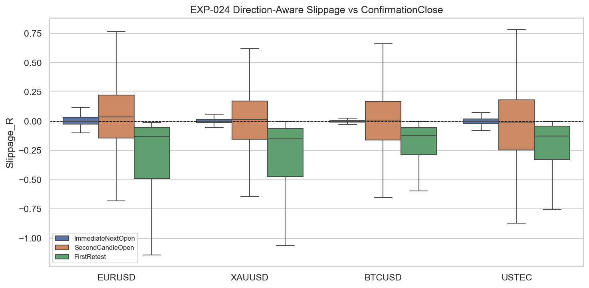
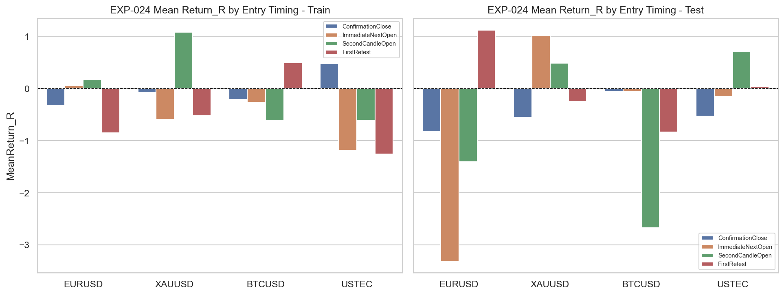
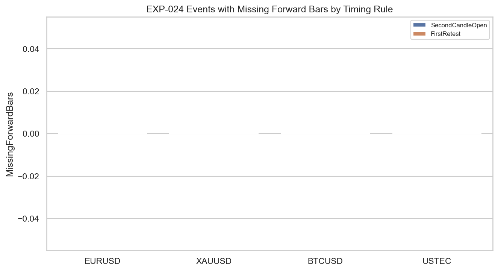

# Experiment Report: EXP-024 - Second Candle Open Execution Timing

## Status: SUPPORTED

**Date**: 2026-05-26
**Instruments**: EURUSD, XAUUSD, BTCUSD, USTEC
**Data Views / Feature Categories**: 1-minute time bars, IFVG confirmation events, post-confirmation entry timing variants

---

## Question

Does the ICT second-candle-open execution rule improve or degrade entry quality versus simpler post-confirmation entries?

## Hypothesis

The ICT second-candle-open execution rule has equal or better trade quality than simpler post-confirmation entries.

## Method Summary

EXP-024 reused the fixed EXP-021 confirmation event set and compared confirmation-close, immediate-next-open, second-candle-open, and first deterministic retest entries using real 1-minute time-bar outcomes. After the revision, each timing row inherited the minimum feasible risk floor from EXP-021, and any timing variant below that floor was excluded from R-based outcome and slippage summaries while remaining visible in timing diagnostics.

## Key Findings

### Finding 1: The rerun is trustworthy and fully populated

The inherited-risk feasibility guard removes the prior denominator-collapse problem cleanly. `61` of `5,526` timing rows are filtered out of R-based summaries, and none contributes a stored R or slippage value.

No entry proxy suffers missing-forward-bar loss in the rerun, so the timing comparison is not being distorted by a data-availability artifact.

### Finding 2: Second-candle-open clears the scoped gate on all four instruments

Every instrument has `>= 50` feasible confirmation-close and second-candle-open rows in both train and test, and every instrument passes the predeclared return / MAE / slippage non-inferiority gate.

That is enough for a scoped support result: the rule does not show statistically worse trade quality than confirmation-close across the four-instrument basket.

### Finding 3: The support is about not being worse, not about clear extra edge

The point estimates are mixed. EURUSD Train and USTEC Test look better at second-candle-open, while BTCUSD Test looks worse in point estimate but not in interval terms.

Hit-rate differences also remain small and statistically unresolved, so the claim here is conservative: second-candle-open is a defensible timing variant, not a proven universal expectancy upgrade.

## Conclusion

**Hypothesis SUPPORTED.**

Under the scoped non-inferiority rule, second-candle-open is acceptable as an execution timing choice. The rerun resolves the denominator trust issue and shows `4/4` instruments passing with adequate feasible counts. The support should be read narrowly: the rule preserves quality well enough to keep, but it does not prove a broad standalone edge boost.

## Limitations

- Uses the refuted EXP-021 IFVG confirmation set as its event source, so this result isolates timing only.
- Uses a non-inferiority-style support rule rather than demanding positive expectancy improvement everywhere.
- Uses 1-minute OHLC prices only and no transaction-cost model.

## Implications for Future Research

- Second-candle-open can remain in the execution toolbox for later gated ICT model tests.
- The underlying confirmation component still matters more than the timing tweak; timing support does not rescue a weak confirmation layer by itself.

## Recommended Next Experiments

1. **Carry-forward timing rule**: Keep second-candle-open available in later component ablation and full-model experiments, with the feasible-risk guard preserved.
2. **Context-specific follow-up**: If timing is revisited, test it only inside a stronger confirmation framework rather than reopening the broad IFVG path.

## Artifacts

| Artifact | Path |
|----------|------|
| Scope | [scope.md](scope.md) |
| Analysis Plan | [analysis-plan.md](analysis-plan.md) |
| Code | [code/](code/) |
| Audit | [audit.md](audit.md) |
| Results | [results.md](results.md) |
| Governance Reviews | [governance/](governance/) |
| Result Tables | [results/](results/) |
| Plots | [plots/](plots/) |
