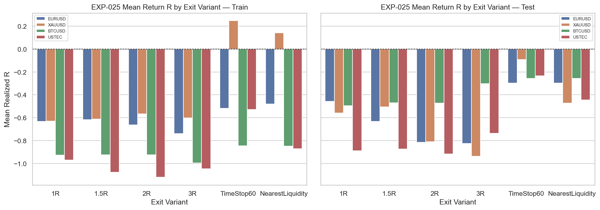
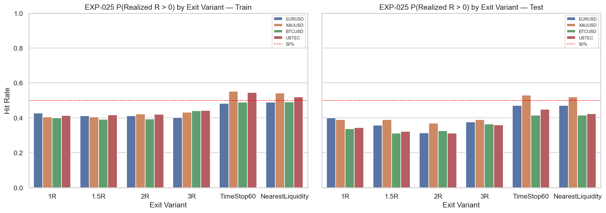
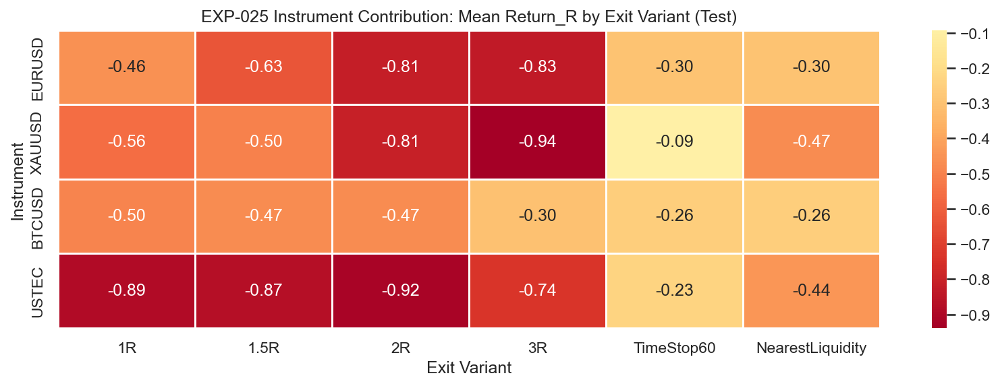

# Experiment Report: EXP-025 - Fixed 1 to 2 Risk Reward Justification

## Status: INCONCLUSIVE

**Date**: 2026-05-26
**Instruments**: EURUSD, XAUUSD, BTCUSD, USTEC
**Data Views / Feature Categories**: 1-minute time bars, EXP-024 second-candle-open entries, fixed-R and alternative exit variants

---

## Question

Is the fixed `1:2` risk/reward target justified versus alternatives?

## Hypothesis

A fixed `2R` target is justified only if it outperforms simpler target and exit alternatives for the approved entry definition.

## Method Summary

EXP-025 reused the approved EXP-024 second-candle-open entry set, kept the inherited stops frozen, and simulated six scoped exits on real 1-minute OHLC paths: `1R`, `1.5R`, `2R`, `3R`, `TimeStop60`, and `NearestLiquidity`. The comparison used train/test summaries plus bootstrap intervals for `2R` versus each alternative without retuning entries, stops, or horizons after seeing outcomes.

## Key Findings

### Finding 1: The experiment is well-powered enough to answer the scoped question

All four instruments clear the predeclared test floor and comparator-coverage gate.

That matters because the stored no-go is evidence-based rather than a sample-size failure.

### Finding 2: 2R shows no positive superiority evidence on any instrument

`results.json` records `0/4` passing instruments and `4/4` fully comparable instruments. Every bootstrap comparison involving `2R` keeps zero inside the interval.

The fixed `2R` claim therefore fails to earn the positive justification the scope required.

### Finding 3: Simpler exits are usually better in point estimate anyway

On the test segment, `TimeStop60` beats `2R` in mean return on EURUSD, XAUUSD, BTCUSD, and USTEC, and BTCUSD `3R` also beats `2R` in point estimate.

This does not trigger the experiment's formal "against" rule, but it does make the practical conclusion straightforward: `2R` is not the exit to carry forward from this chain.

## Conclusion

**Hypothesis INCONCLUSIVE.**

Under the frozen interpretation rule, `2R` is neither superior enough to support nor dominated enough to refute. But the operational lesson is still narrow and useful: for the EXP-024 entry source, a fixed `2R` target is not positively justified and should not be promoted into downstream model selection.

## Limitations

- This experiment inherits one specific entry definition from EXP-024.
- It uses a fixed 60-minute horizon rather than a broader trade-management study.
- It does not include transaction costs.

## Implications for Future Research

- Phase 003 should treat `RiskModel_2R` as a failed candidate-selection input for the current chain.
- Any future exit-model work should start from a stronger candidate entry definition, not from the assumption that `2R` is desirable by default.

## Recommended Next Experiments

1. **Narrower risk-model scope**: revisit exits only if a future entry candidate materially improves the upstream edge.
2. **Instrument-specific follow-up**: any targeted exit work should be explicitly scoped by instrument and entry family rather than reviving the broad cross-instrument H6 claim.

## Artifacts

| Artifact | Path |
|----------|------|
| Scope | [scope.md](scope.md) |
| Analysis Plan | [analysis-plan.md](analysis-plan.md) |
| Code | [code/](code/) |
| Audit | [audit.md](audit.md) |
| Results | [results.md](results.md) |
| Governance Reviews | [governance/](governance/) |
| Result Tables | [results/](results/) |
| Plots | [plots/](plots/) |
