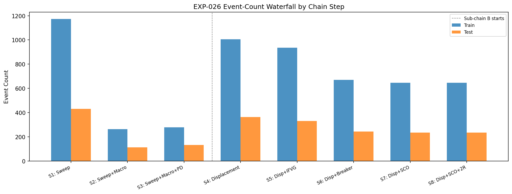
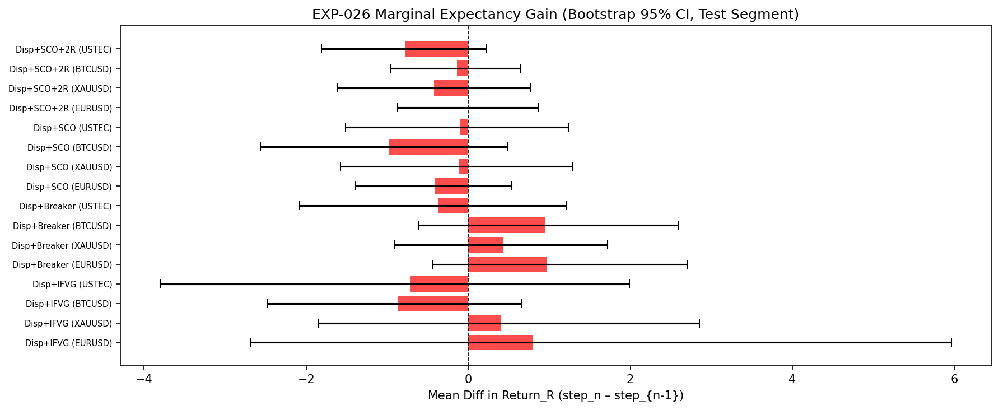
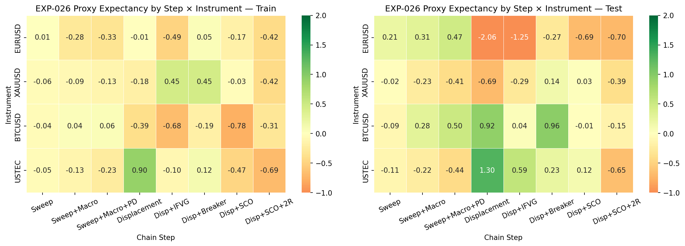

# Experiment Report: EXP-026 - Incremental ICT Component Ablation

## Status: INCONCLUSIVE

**Date**: 2026-05-26
**Instruments**: EURUSD, XAUUSD, BTCUSD, USTEC
**Data Views / Feature Categories**: 1-minute time bars, prior ICT component outputs, fixed-order component chain

---

## Question

Which validated components contribute net value when combined incrementally?

## Hypothesis

Validated ICT components contribute measurable net value when combined incrementally, after accounting for sample-size loss.

## Method Summary

EXP-026 read the completed EXP-015 through EXP-025 outputs, classified component eligibility, then assembled the fixed-order chain declared in the scope. Marginal contribution was judged with bootstrap mean-difference intervals on adjacent chain steps, and a component could enter the frozen full-model manifest only if it was candidate-eligible and had positive lower-CI evidence on enough instruments.

## Key Findings

### Finding 1: The chain exists, but only the baseline pair stays defensible

Sweep and Displacement remain the minimum viable chain. The experiment preserves enough events to evaluate later layers, but that alone is not enough for model promotion.

This matters because the downstream no-go is about contribution quality, not about missing infrastructure.

### Finding 2: No optional component adds robust net value

`bootstrap_marginal.csv` contains no Test rows with both a positive point estimate and a positive lower confidence bound.

The result is especially clear at the Step 7 execution-rule layer: second-candle-open is negative in point estimate on all four instruments in the ablation comparison.

### Finding 3: No full-model candidate survives the ablation gate

The final manifest keeps only `["Sweep", "Displacement"]` and sets `candidate_eligible = false`.

That blocks EXP-027 from being a real model-performance test under the current Phase 003 chain.

## Conclusion

**Hypothesis INCONCLUSIVE.**

The experiment does not show that the optional ICT layers add enough robust value to justify a promoted full-model candidate. The useful outcome is a disciplined stop: the phase now knows that the current chain does not earn a full-model test.

## Limitations

- Early structural steps are measured with proxy expectancy rather than full trade outcomes.
- The ablation inherits prior experiment definitions and verdicts.
- It does not search for new component orders or new variants.

## Implications for Future Research

- Phase 003 should not treat the current chain as an eligible full-model candidate.
- Any continuation should be narrower: either a new candidate component or a deliberately instrument-specific thesis.

## Recommended Next Experiments

1. **New candidate-forming experiment**: propose and test one narrower optional component that could genuinely change the manifest.
2. **Instrument-specific branch**: if a future ICT idea looks promising only on one instrument, scope that explicitly instead of reusing the broad four-instrument gate.

## Artifacts

| Artifact | Path |
|----------|------|
| Scope | [scope.md](scope.md) |
| Analysis Plan | [analysis-plan.md](analysis-plan.md) |
| Code | [code/](code/) |
| Audit | [audit.md](audit.md) |
| Results | [results.md](results.md) |
| Governance Reviews | [governance/](governance/) |
| Result Tables | [results/](results/) |
| Plots | [plots/](plots/) |
