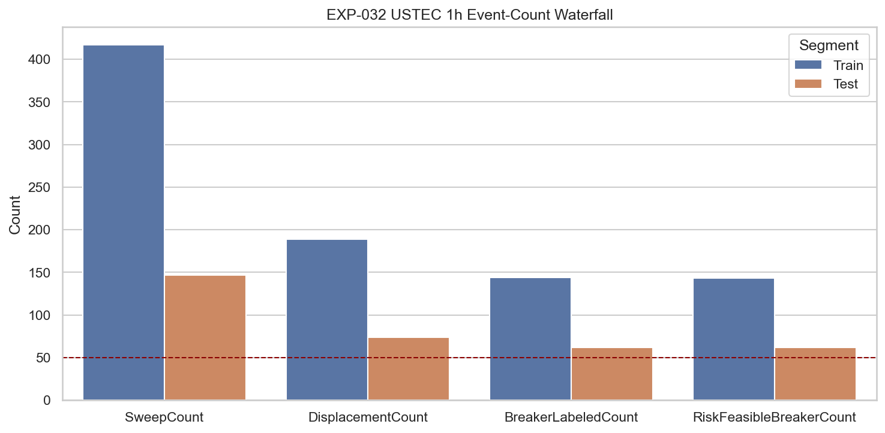
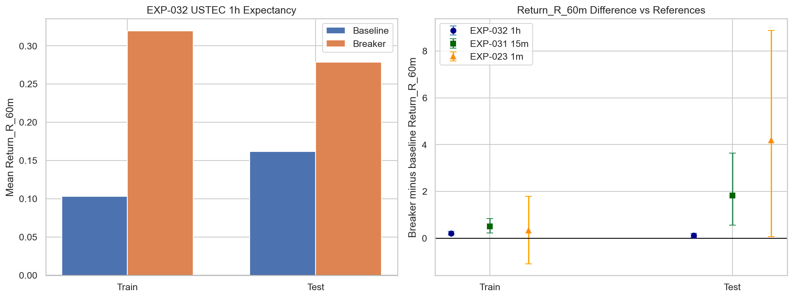
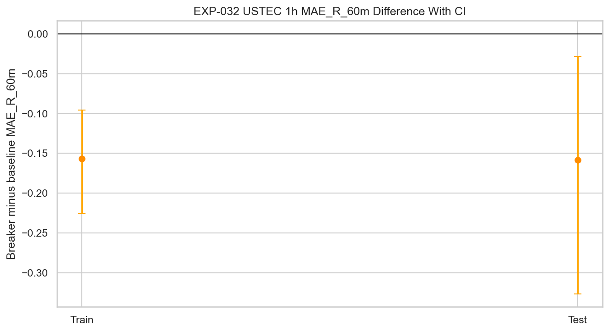

# Report: EXP-032 - 1-Hour USTEC Candidate A Breaker Magnitude Gate

**Phase**: 004B (Branch A conditional 1-hour extension)  
**Date**: 2026-05-27  
**Status**: REFUTED  
**Instruments**: USTEC only

---

## One-Line Finding

The 1-hour Candidate A breaker chain stays directionally positive, but the test Return_R_60m improvement is only `+0.116R` with CI `[+0.039, +0.220]`, far below the binding `+0.918R` threshold; Branch A should stop before temporal segmentation unless a new reflection explicitly reframes it.

## Question

Does the USTEC Candidate A breaker chain remain directionally positive and magnitude-comparable at 1-hour resolution, or should Branch A stop or be reframed before further breaker validation experiments?

## Hypothesis

The USTEC Candidate A breaker chain, applied to synthetic 1-hour bars with elapsed-time-scaled definitions, preserves the EXP-031 15-minute positive direction and reaches a predeclared minimum magnitude before Branch A is allowed to proceed to temporal segmentation.

## Method Summary

USTEC 1-minute analysis-set bars were aggregated into synthetic 1-hour OHLC bars after excluding the final 30 percent global holdout. Sweep, displacement, and Candidate A breaker detection ran on the 1-hour bars with elapsed-time-scaled constants. Return_R, MAE_R, MFE_R, hit rates, and log returns were evaluated on real 1-minute OHLC strictly after the confirming 1-hour displacement candle close.

The primary comparison is breaker-labeled displacement events versus the displacement baseline, using a label-stratified bootstrap with 10,000 resamples. The binding gate is the 1-hour test Return_R_60m diff reaching at least 50 percent of EXP-031's 15-minute test diff.

## Key Findings

### Finding 1: Counts passed, so the result is interpretable

| Segment | Sweeps | Displacement | Breaker-Labeled | Feasible Breaker | Floor >= 50 |
| --- | ---: | ---: | ---: | ---: | --- |
| Train | 417 | 189 | 144 | 143 | PASS |
| Test | 147 | 74 | 62 | 62 | PASS |

Displacement retention versus EXP-031 was `263 / 463 = 0.568`, above the 30 percent retention floor. This rules out a simple count-collapse explanation.

### Finding 2: Return_R is positive but far too small

| Segment | Baseline | Breaker | Diff | 95% CI |
| --- | ---: | ---: | ---: | --- |
| Train | `+0.103R` | `+0.320R` | `+0.216R` | `[+0.144, +0.298]` |
| Test | `+0.162R` | `+0.278R` | `+0.116R` | `[+0.039, +0.220]` |

The 1-hour test diff is positive, but it is only about 6 percent of EXP-031's 15-minute test diff (`+1.836R`). It fails the binding 50 percent threshold (`+0.918R`) by a wide margin.

### Finding 3: MAE improves, but not enough to rescue the branch

| Segment | Baseline MAE | Breaker MAE | Diff | 95% CI |
| --- | ---: | ---: | ---: | --- |
| Train | `0.481R` | `0.324R` | `-0.157R` | `[-0.226, -0.096]` |
| Test | `0.470R` | `0.311R` | `-0.159R` | `[-0.327, -0.029]` |

The breaker still filters adverse excursion, but the drawdown improvement is modest and the MFE_R bootstrap intervals cross zero. The scoped branch gate is based on Return_R magnitude, not MAE.

## Conclusion

**REFUTED.**

EXP-032 does not support Branch A continuation. The 1-hour Candidate A breaker chain keeps adequate event counts and positive train/test Return_R direction, but the test effect (`+0.116R`) is far below the predeclared `+0.918R` hard gate. Per the scope, this stops Branch A before EXP-033 unless checkpoint governance explicitly reframes the branch with weaker claims.

The useful residual finding is narrow: Candidate A at 1-hour still reduces MAE_R by about `0.16R` in both segments, suggesting some adverse-excursion selectivity. That is not enough to preserve the stronger Candidate A validation path.

## Limitations

- USTEC only; no cross-instrument claim is made.
- Event-level bootstrap intervals do not eliminate temporal-dependence risk.
- One train risk-feasible breaker row had no forward 1-minute outcome path and was excluded from finite Return_R means/CIs; this does not affect the verdict.
- Same-candle duplicate level-family events are retained by the scoped first-touch denominator policy.

## Recommended Next Experiments

No automatic EXP-033 temporal segmentation should proceed under the current Branch A validation path. A future checkpoint decision may close Branch A or define a new, weaker scope around drawdown filtering or execution timing.

## Artifacts

| Artifact | Path |
| --- | --- |
| Scope | [scope.md](scope.md) |
| Analysis Plan | [analysis-plan.md](analysis-plan.md) |
| Code | [code/run_experiment.py](code/run_experiment.py) |
| Audit | [audit.md](audit.md) |
| Results Interpretation | [results.md](results.md) |
| Governance Reviews | [governance/](governance/) |
| Result Tables | [results/](results/) |
| Plots | [plots/](plots/) |
