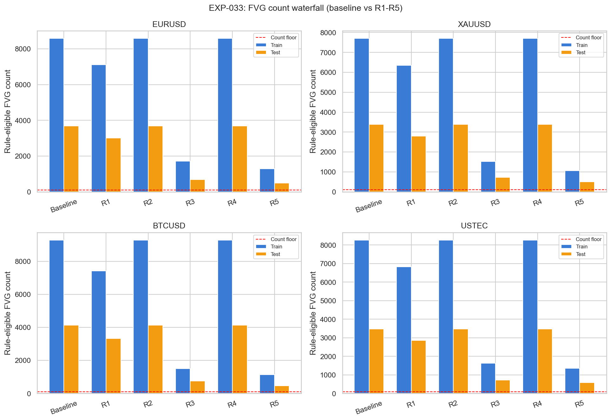
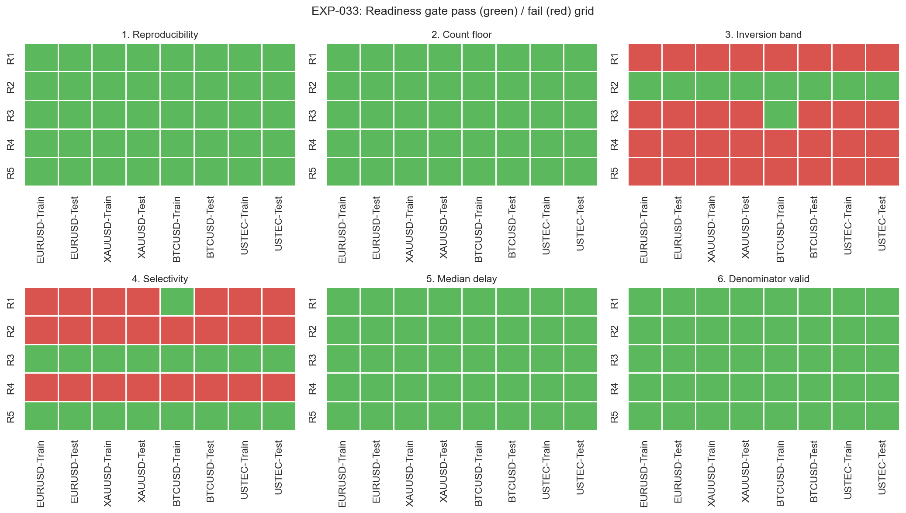
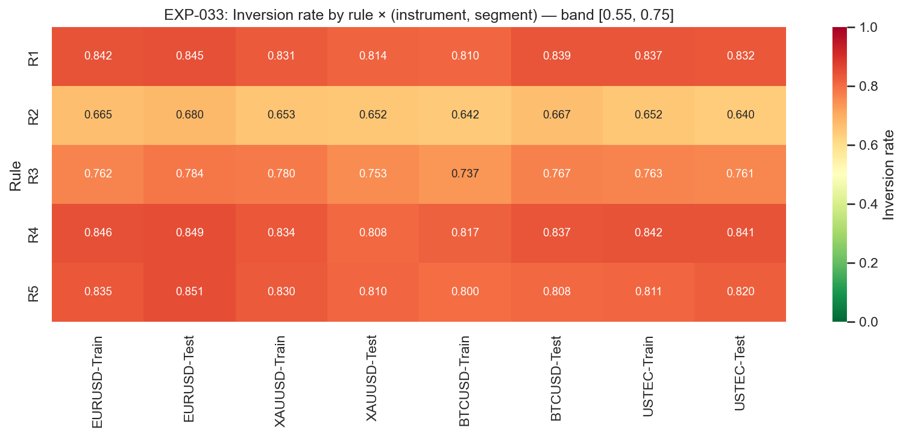
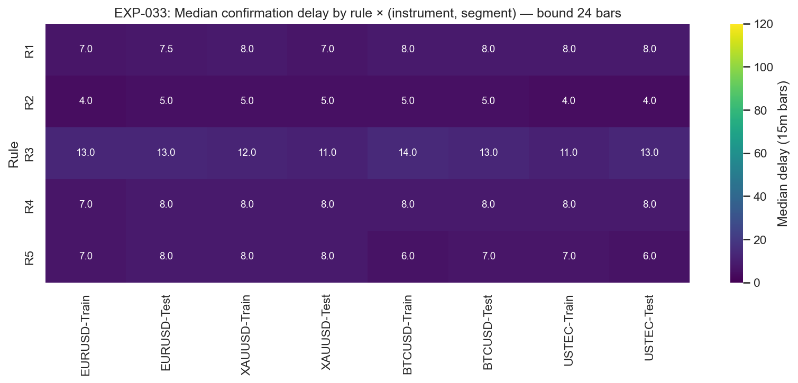

# Experiment Report: EXP-033 - 15-Minute IFVG Rule Family Readiness Survey

## Status: REFUTED

**Date**: 2026-05-27  
**Instruments**: EURUSD, XAUUSD, BTCUSD, USTEC  
**Data Views / Feature Categories**: holdout-excluded 1-minute time bars aggregated to synthetic 15-minute OHLC; FVG/IFVG readiness rules

---

## Question

Does any single predeclared IFVG/FVG rule-family modification produce a deterministic, count-eligible, non-tautological, and meaningfully selective IFVG definition on at least two instruments at 15-minute resolution, qualifying that rule for downstream entry-quality testing in EXP-034?

## Hypothesis

At least one of five rule families applied independently to the EXP-020/EXP-029 three-candle FVG and close-through IFVG detector on synthetic 15-minute bars is deterministic, count-eligible, materially less tautological than the 84-85 percent baseline, meaningfully selective, and bounded in confirmation delay on at least two of four instruments in both train and test segments.

## Method Summary

The experiment recomputed the unfiltered 15-minute FVG/IFVG baseline for each instrument and segment, then applied five fixed rule families: R1 stricter size, R2 shorter lifecycle, R3 displacement-qualified FVG creation, R4 mitigation-before-inversion, and R5 zone-location near swept levels. Each `(rule, instrument, segment)` cell was evaluated against six readiness checks: reproducibility, count floor, inversion-rate band, FVG-count selectivity, median confirmation delay, and valid denominators. Selection was mechanical and used no return, excursion, hit-rate, or P&L metric.

## Key Findings

### Finding 1: Baseline detection replicated EXP-029

The unfiltered 15-minute detector produced 3,391-9,283 FVGs and 2,783-7,671 IFVGs per segment, with inversion rates from 0.821 to 0.857. These values reproduce the EXP-029 reference range and confirm that the rule-family survey used the same baseline detector and analysis-set data view.

### Finding 2: Determinism passed, but no rule passed readiness

All 40 reproducibility digests matched between the canonical pipeline and the shuffled-then-resorted input path. The failure is therefore not an ordering or implementation artifact. No rule family passed all six readiness checks on both train and test for any instrument, and every rule had `qualifying_instrument_count = 0`.

### Finding 3: R2 fixed inversion rate but not FVG selectivity

R2, the 24-bar lifecycle rule, reduced inversion rates to 0.640-0.680 across all cells, inside the predeclared `[0.55, 0.75]` band. It failed the FVG-count selectivity gate by construction because it changes only the inversion window, not FVG creation; its selectivity ratio remained 1.0 in every segment.

### Finding 4: R3 was the closest miss

R3 retained only 16-22 percent of baseline FVGs and passed the selectivity gate, but inversion rates mostly stayed above the 0.75 upper band. BTCUSD Train was the only cell to pass all six checks, with inversion rate 0.737; BTCUSD Test failed the inversion band at 0.767.

## Conclusion

**Hypothesis REFUTED.**

The hypothesis required at least one rule family to pass all six readiness checks on at least two instruments, with both train and test segments satisfied. None did. The aggregate verdict is therefore the predeclared outcome: Branch B closes at EXP-033 with a selectivity-gated no-go, and no EXP-034 entry-quality scope is authorized from this rule menu.

The main empirical lesson is that the high IFVG inversion rate is not solved by the tested single-rule modifications. R2 shows that shortening the lifecycle can bring the inversion rate into a useful band, but it does not create FVG-level selectivity under this scope. R3 and R5 create selectivity, but their inversion rates remain near the tautological baseline.

## Limitations

- Selectivity was predeclared as `rule_eligible_fvg_count / baseline_fvg_count`; R2 and R4 could not pass this gate because they modify only inversion qualification.
- The five rules were tested independently. Rule combinations such as R2 plus R3 were out of scope.
- Bootstrap intervals were descriptive only; the readiness verdict used point estimates as predeclared.
- The experiment did not compute entry-quality, returns, excursions, hit rates, costs, or P&L.

## Implications for Future Research

- Phase 004 can close Branch B cleanly: no predeclared IFVG rule family produced a candidate eligible for outcome testing.
- A future phase could ask a different question at the IFVG-event level, where selectivity is measured against baseline IFVG count rather than baseline FVG count.
- Any combination-rule survey needs a new checkpoint design and fresh scope; it cannot be treated as a continuation of EXP-033.

## Recommended Next Experiments

1. **Phase 004 retrospective**: record that Branch A closed at EXP-032 and Branch B closed at EXP-033, with no candidate manifest.
2. **Future checkpoint IFVG-event selectivity scope**: test whether lifecycle-style rules should be evaluated on IFVG-count reduction rather than FVG-count reduction.
3. **Future checkpoint rule-combination scope**: if authorized, predeclare combinations such as R2 and R3 before inspecting outcomes.

## Artifacts

| Artifact | Path |
|----------|------|
| Scope | [scope.md](scope.md) |
| Analysis Plan | [analysis-plan.md](analysis-plan.md) |
| Code | [code/run_experiment.py](code/run_experiment.py) |
| Audit | [audit.md](audit.md) |
| Results | [results.md](results.md) |
| Governance Reviews | [governance/](governance/) |
| Raw Results | [results/](results/) |
| Plots | [plots/](plots/) |
