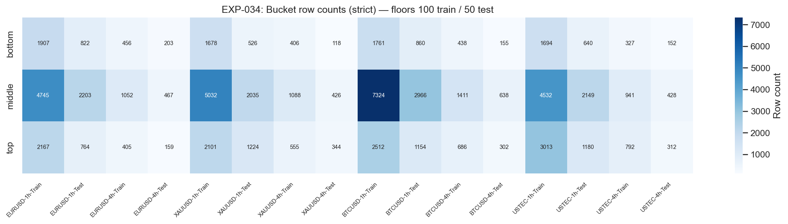
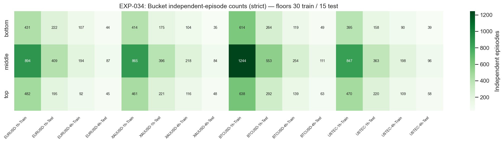
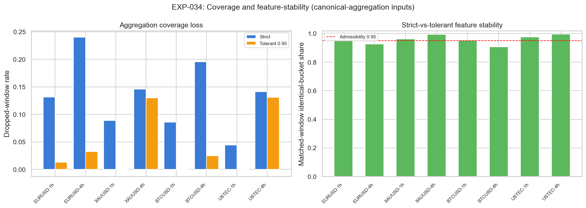

# Experiment Report: EXP-034 - Prior-Range Location Readiness and Shared Aggregation-Coverage Rule

## Status: SUPPORTED

**Date**: 2026-05-29
**Instruments**: EURUSD, XAUUSD, BTCUSD, USTEC
**Data Views / Feature Categories**: 1-minute time bars aggregated to strict and tolerant `1h`/`4h` real OHLC; Prior-Range Location buckets

---

## Question

Can the Prior-Range Location descriptor produce deterministic, count-eligible bottom/middle/top states at `1h`/`4h`, and can the Phase 005 aggregation coverage rule be decided without inspecting returns?

## Hypothesis

On holdout-excluded `1h` and `4h` real-price bars, fixed `20`-bar Prior-Range Location buckets (`<=0.20`, `(0.20,0.80)`, `>=0.80`) meet row and independent-episode floors on at least two distinct instruments, and the shared strict-vs-tolerant aggregation rule is decidable by coverage and feature-stability diagnostics.

## Method Summary

The experiment loaded only the first chronological 70 percent of each instrument's 1-minute bars, aggregated those analysis-set bars to `1h` and `4h`, and computed Prior-Range Location from the prior 20 completed bars. It reported exact bucket counts, independent episode counts, denominator validity, deterministic shuffle-then-resort digests, and strict-vs-tolerant coverage stability. No return, excursion, hit-rate, or P&L metric was computed.

## Key Findings

### Finding 1: Strict aggregation passes readiness on all instruments

All four instruments pass the row, episode, determinism, and denominator checks under strict aggregation at both `1h` and `4h`. The smallest strict bucket row count is `118`, and the smallest strict independent-episode count is `35`, both above the relevant test floors.

### Finding 2: Tolerant aggregation is not needed and can perturb 4h buckets

Strict dropped-window rates are material, especially at `4h` (`14.10%` to `24.00%`), but strict still passes readiness everywhere. Tolerant `0.90` aggregation lowers dropped-window rates but fails the `0.95` matched-bucket stability threshold at `EURUSD 4h` and `BTCUSD 4h`.

## Conclusion

**Hypothesis SUPPORTED.**

Prior-Range Location is count-eligible for the next Phase 005 decision gate. The result does not establish an edge; it establishes that the descriptor is deterministic and sufficiently populated for a later return test if the mid-phase reflection authorizes one. Strict aggregation should remain the canonical rule for this descriptor because it passes without using the potentially feature-perturbing tolerant windows.

## Limitations

- Readiness-only: no forward return, matched control, FE/AE, hit rate, or P&L was tested.
- Tolerant coverage diagnostics are useful for context but not canonical here because strict aggregation passed.
- The result says the descriptor can be tested, not that it should be traded.

## Implications for Future Research

- Prior-Range Location is eligible for the mid-phase reflection as the highest-priority directional candidate.
- The reflection should not use tolerant aggregation for Prior-Range Location unless it explicitly accepts the feature-stability trade-off.
- EXP-035's corrected rerun is needed before the reflection can choose the next return-test scope.

## Recommended Next Experiments

1. **EXP-036 (proposed)**: If the mid-phase reflection approves, test Prior-Range Location's executable state-aligned return against its neutral bucket and prior-bar momentum control using strict aggregation.

## Artifacts

| Artifact | Path |
|----------|------|
| Scope | [scope.md](scope.md) |
| Analysis Plan | [analysis-plan.md](analysis-plan.md) |
| Code | [code/](code/) |
| Audit | [audit.md](audit.md) |
| Results | [results.md](results.md) |
| Governance Reviews | [governance/](governance/) |
| Plots | [plots/](plots/) |
| Machine-Readable Results | [results/](results/) |
