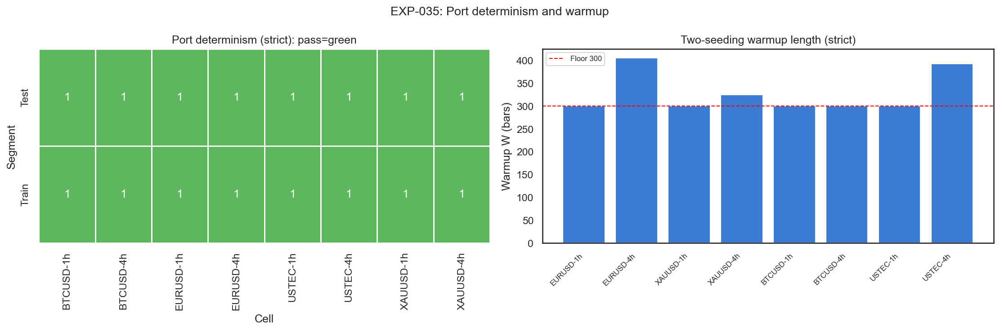
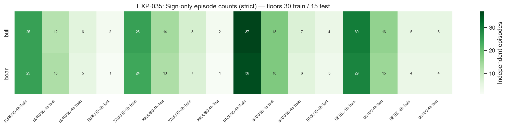
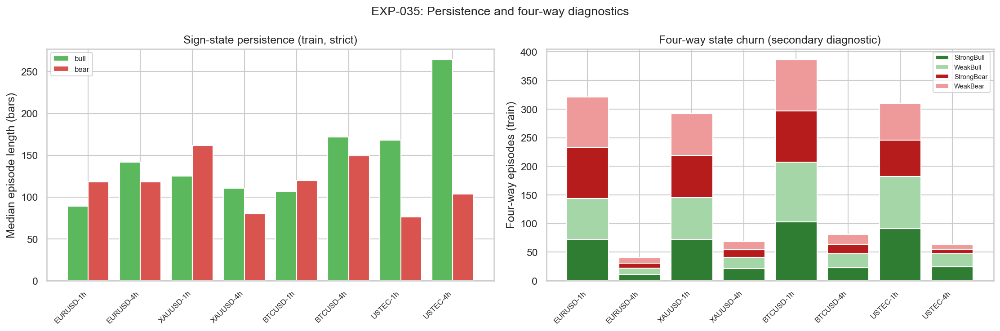

# Experiment Report: EXP-035 — Market Bias (CEREBR) Deterministic Port and State-Episode Readiness

## Status: SUPPORTED (conditional — readiness only on `1h/tolerant`, `BTCUSD`+`USTEC`)

**Date**: 2026-05-29
**Instruments**: EURUSD, XAUUSD, BTCUSD, USTEC
**Data Views / Feature Categories**: 1-minute time bars aggregated to strict and tolerant `1h`/`4h` real OHLC; Market Bias sign-only and four-way states

---

## Question

Does a deterministic Python port of the Market Bias indicator reproduce the published Pine v5 formula in chart-timeframe mode; what is the predeclared two-seeding warmup length `W`; and do its sign-only (bull/bear) and four-way states have adequate independent-episode counts at `1h`/`4h` per instrument and segment — without inspecting any return?

## Hypothesis

On holdout-excluded `1h`/`4h` real-price bars, the chart-timeframe Market Bias port is deterministic (identical under shuffle-then-resort, convergent two-seeding warmup) and its sign-only states meet the row and independent-episode floors on at least two distinct instruments in both train and test segments under an admissible aggregation.

## Method Summary

The experiment loaded only the first chronological 70% of each instrument's 1-minute bars, aggregated to `1h`/`4h` under both strict (`min_coverage=None`) and tolerant (`min_coverage=0.90`) coverage, and computed Market Bias states from the ported `EMA(OHLC,100) → Heiken-Ashi (with the source `xhaopen[1]` recursion) → EMA(haopen/haclose,100) → osc_bias = 100·(c2−o2)`, `osc_smooth = EMA(osc_bias,7)` pipeline. The warmup `W` was set per the predeclared two-seeding (Pine-SMA vs cold) identical-label convergence rule, floored at 300, and discarded before counting. It then reported determinism digests, warmup convergence, sign-only and four-way independent-episode counts, persistence, transitions, `|osc_bias|` quartiles, and dominant-state share. No return, excursion, hit-rate, or P&L metric was computed.

A post-execution audit found a Critical bug — the no-collapse check used `np.isnan(value) is False`, a NumPy-boolean identity comparison that is always false, inverting `Check5NoCollapse`. The predicate was patched to `np.isfinite(dominant_share) and dominant_share <= 0.95`, and the experiment was rerun. This report describes the corrected rerun (re-audit: PASS).

## Key Findings

### Finding 1: The port is deterministic and the warmup converges everywhere

All 32 instrument/timeframe/aggregation/segment rows pass the determinism digest and the two-seeding warmup convergence (`W` in `[300, 405]`). The formula-fidelity question is thus held separate from count-eligibility.

### Finding 2: Episode readiness passes only on `1h/tolerant`, for crypto and the index

The only `(timeframe, aggregation)` cell with `>= 2` distinct instruments passing both segments is `1h/tolerant` (`BTCUSD`, `USTEC`). Under canonical strict aggregation, only `BTCUSD` passes `1h`. The independent-episode floor is the binding constraint (fails 25 of 32 rows).

### Finding 3: `4h` and FX/gold fall short; no state collapses

Every `4h` cell fails the episode floor (train sign-episodes `4–9`), and `EURUSD`/`XAUUSD` fall just short at `1h` (`24–28` train episodes vs the `30` floor) because the double-`EMA(100)` smoothing yields long, rarely-flipping states. No cell collapses — `DominantShare` peaks at `0.774`.

## Conclusion

**Hypothesis SUPPORTED, conditionally.**

The Market Bias port is deterministic and warmup-convergent on all instruments and timeframes, and its sign-only states are count-eligible on `BTCUSD` and `USTEC` at `1h` under tolerant aggregation. The support is narrow and aggregation-dependent: under the strict rule EXP-034 prefers, Market Bias has a single passing instrument (inconclusive). The result establishes that the descriptor *can* be return-tested on a specific cell, not that it carries edge.

## Limitations

- Readiness-only: no return, control-adjusted differentiation, FE/AE, hit rate, or P&L.
- Aggregation-dependent: the pass exists only under tolerant `0.90`; strict yields a single-instrument inconclusive.
- Instrument-concentrated: only `BTCUSD`/`USTEC` clear the floor; `EURUSD`/`XAUUSD` do not.
- Unverified fidelity: deterministic re-implementation only; no TradingView reference series, so Pine-equivalence is not claimed. Any later negative Market Bias return result must carry this caveat.

## Implications for Future Research

- The mid-phase reflection must resolve a phase-level aggregation-canonicity decision: a single strict rule demotes Market Bias to inconclusive, whereas admitting tolerant for this descriptor keeps it alive on two instruments.
- Any authorized Market Bias return test should be scoped on `1h/tolerant`, `BTCUSD`+`USTEC`, sign-only states, with the deterministic-only fidelity caveat attached.
- Obtaining one exported TradingView reference series before a return test would convert the fidelity claim from re-implementation to a verified match.

## Recommended Next Experiments

1. **Mid-phase reflection (Phase 005)**: decide the canonical aggregation rule across descriptors, recording its effect on both EXP-034 (Prior-Range Location) and EXP-035 (Market Bias) readiness, then rank return-test candidates.
2. **EXP-037 (proposed, conditional)**: if authorized, test Market Bias sign-state-aligned executable returns on `1h/tolerant`, `BTCUSD`+`USTEC`, against a neutral/sign-flip control — carrying the unverified-fidelity caveat.

## Artifacts

| Artifact | Path |
|----------|------|
| Scope | [scope.md](scope.md) |
| Analysis Plan | [analysis-plan.md](analysis-plan.md) |
| Code | [code/](code/) |
| New Module | [python/src/market_bias.py](../../src/market_bias.py) |
| Audit (incl. re-audit) | [audit.md](audit.md) |
| Results | [results.md](results.md) |
| Governance Reviews | [governance/](governance/) |
| Plots | [plots/](plots/) |
| Machine-Readable Results | [results/](results/) |
