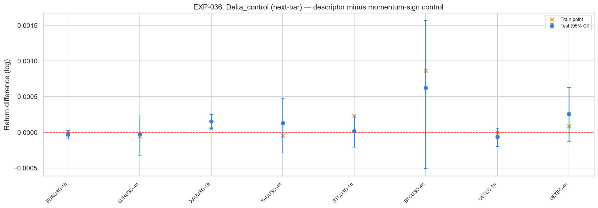
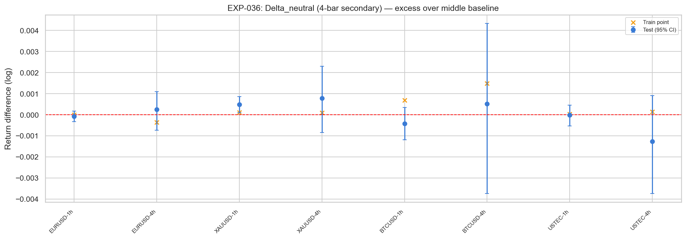
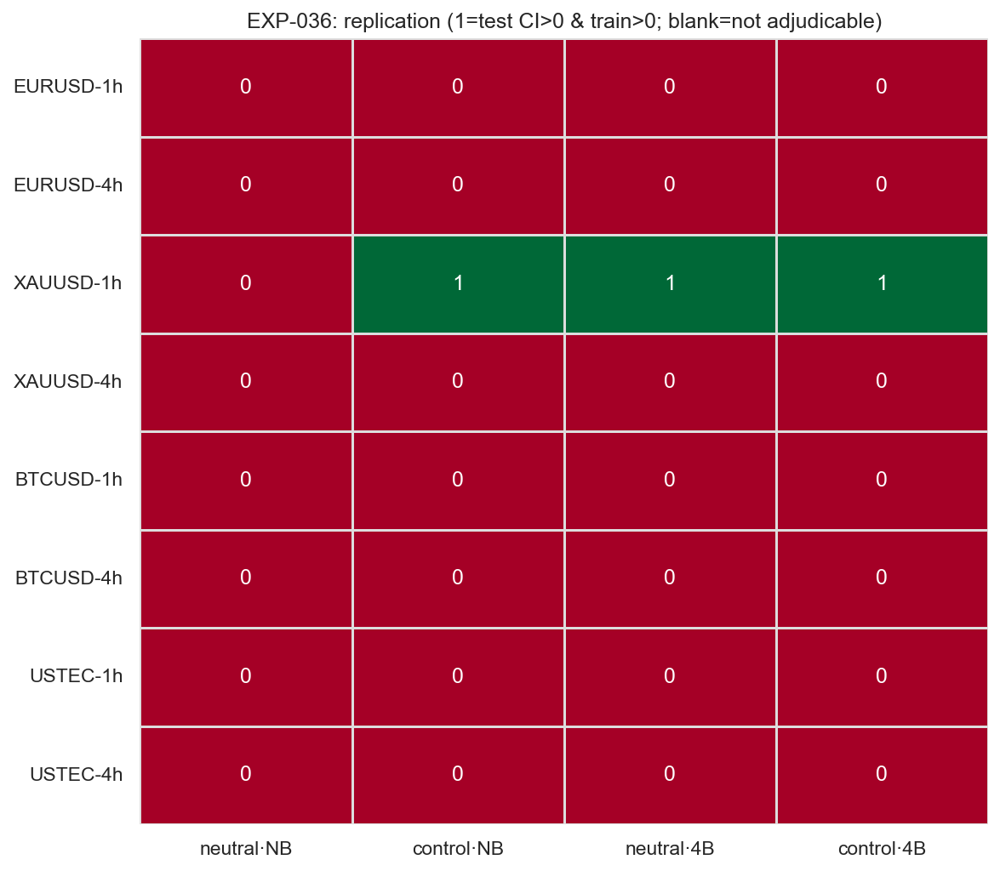

# Experiment Report: EXP-036 - Prior-Range Location Executable State-Aligned Return Test

## Status: REFUTED

**Date**: 2026-05-29
**Instruments**: EURUSD, XAUUSD, BTCUSD, USTEC
**Data Views / Feature Categories**: holdout-excluded 1-minute time bars aggregated to strict `1h`/`4h` real OHLC; Prior-Range Location buckets

---

## Question

Does the Prior-Range Location descriptor produce executable, direction-adjusted next-bar return differentiation that beats both its own neutral middle bucket and a matched prior-bar momentum-sign control, replicated across at least two distinct instruments?

## Hypothesis

On strict `1h`/`4h` real-price bars, top range-location states (`>=0.80`) traded long and bottom states (`<=0.20`) traded short should beat the middle-bucket neutral baseline and the same-timeframe prior-bar-momentum control, with episode-level bootstrap CIs and train/test sign preservation on `>=2` distinct instruments. The single predeclared 4-bar hold can only identify horizon-dependent differentiation, not an edge candidate.

## Method Summary

The script loads only the first chronological 70% of each instrument's 1-minute data, strict-aggregates to `1h` and `4h`, constructs the fixed prior-20-bar range-location buckets, and computes executable real-OHLC returns from the next bar open to next bar close, plus the fixed 4-bar secondary. Inference uses independent state episodes as the bootstrap unit. See [analysis-plan.md](analysis-plan.md) for the full method.

## Key Findings

### Finding 1: The Primary Next-Bar Edge Gate Fails

No next-bar cell passes both required contrasts. `verdict.json` reports empty `next_bar_neutral_and_control` lists for both `1h` and `4h`. The only next-bar matched-control positive cell is `XAUUSD 1h` (`Delta_control = +0.000153`, CI `[+0.000052, +0.000252]`), but its neutral contrast does not pass.

### Finding 2: The 4-Bar Secondary Has Only One Positive Cell

The 4-bar secondary passes both neutral and control contrasts only for `XAUUSD 1h`: `Delta_neutral = +0.000482`, CI `[+0.000088, +0.000855]`, and `Delta_control = +0.000317`, CI `[+0.000040, +0.000571]`. One instrument is below the predeclared `>=2` distinct-instrument gate, so this does not reopen the thesis at the longer horizon.

### Finding 3: Counts Were Adequate

All scoped rows are adjudicable. The minimum post-filter train state count is `326` rows / `89` episodes, and the minimum test state count is `118` rows / `35` episodes, above the `100/30` and `50/15` floors. The result is a return-effect failure, not a count failure.

## Conclusion

**Hypothesis REFUTED.**

Prior-Range Location does not produce a replicated, control-adjusted executable edge under the locked Phase 005 metric. The next-bar primary fails with zero instruments passing both contrasts; the 4-bar secondary has a single positive instrument and does not meet the replication gate. Since Market Bias was already a readiness-gated no-go under canonical strict aggregation, Phase 005 has no surviving directional state-descriptor candidate from its authorized path.

## Limitations

- The `XAUUSD 1h` 4-bar result is a localized positive cell but below the predeclared replication threshold.
- Strict `4h` aggregation carries meaningful gap-spanning entries (`20.6%` to `25.2%`), but robustness to excluding them was reserved for EXP-038 and no survivor exists.
- No cost, slippage, spread, execution-delay, or concentration stress was in scope.

## Implications for Future Research

- Do not open EXP-038 from EXP-036.
- Do not tune Prior-Range Location thresholds, lookback, framing, or horizon inside Phase 005; that would be a new predeclared experiment.
- A phase-level retrospective should record that the cleanest state-descriptor candidate failed the return gate while Market Bias failed canonical readiness.

## Recommended Next Experiments

1. **New checkpoint, not EXP-038**: define a new thesis only if there is a materially different, predeclared descriptor or data source.

## Artifacts

| Artifact | Path |
| --- | --- |
| Scope | [scope.md](scope.md) |
| Analysis Plan | [analysis-plan.md](analysis-plan.md) |
| Code | [code/](code/) |
| Raw Results | [results/](results/) |
| Audit | [audit.md](audit.md) |
| Results Interpretation | [results.md](results.md) |
| Governance Reviews | [governance/](governance/) |
| Plots | [plots/](plots/) |
