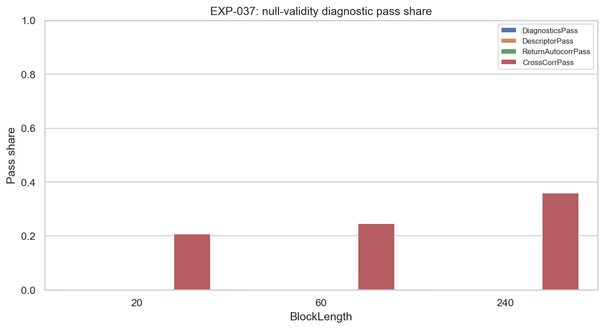
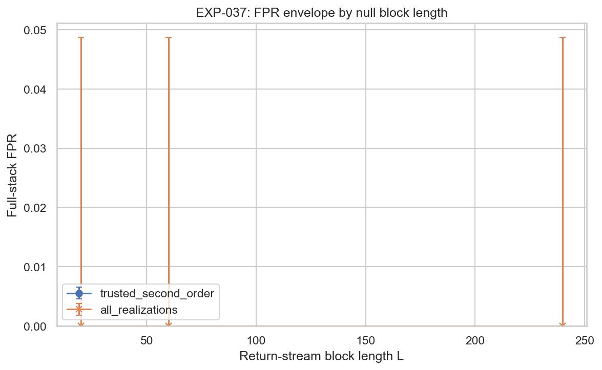
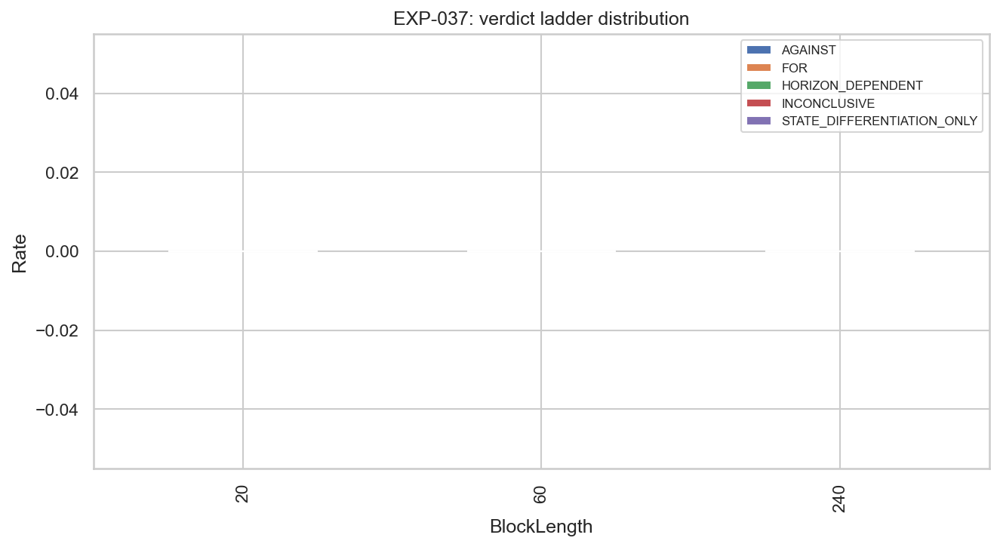
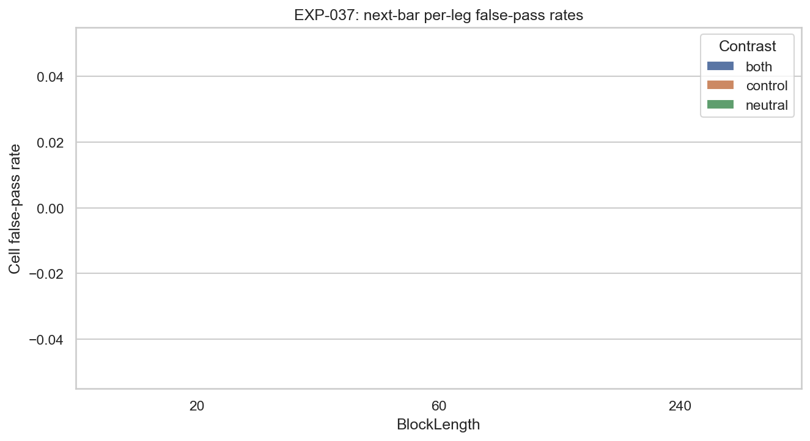

# Experiment Report: EXP-037 — Null Calibration of Frozen Reference Stack

## Status: COMPLETED (hypothesis REFUTED — null-calibration invalidity)

**Date**: 2026-05-31
**Instruments**: EURUSD, XAUUSD, BTCUSD, USTEC
**Data Views / Feature Categories**: holdout-excluded 1-minute time bars aggregated to strict `1h`/`4h` real OHLC; frozen EXP-036 Prior-Range Location descriptor + executable return/control streams; dependence-preserving κ=0 null

---

## Question

Under the frozen Phase-006 Part A null, what is the EXP-036 reference stack's empirical false-positive rate (FPR) at κ=0, and which evidentiary legs leak or over-reject?

## Hypothesis

After the Prior-Range Location descriptor stream is decoupled from the return/control stream while preserving each stream's relevant dependence structure, EXP-037 can estimate the stack's empirical full-stack FPR and per-leg false-pass profile on the second-order calibration holdout for at least one predeclared null block length L ∈ {20, 60, 240}.

## Method Summary

A reusable calibration harness (`python/src/referee_calibration.py`) transcribes the EXP-036 stack verbatim (admissibility layer, E1–E7, verdict ladder) and wraps it with dependence-preserving null resampling: descriptor `(Bucket, D)` resampled in complete state-episode blocks; return/control `(RetNextBar, RetFourBar, Control)` resampled in circular stationary blocks with common cross-instrument starts; the two RNG streams independent so the state→return link is broken. Each realization is gated by null-validity diagnostics (descriptor episode count/length, return autocorrelation signs, cross-instrument correlation) before its FPR is trusted, and trust attaches only to odd-seed second-order-holdout realizations. 150 realizations × 3 block lengths = 450 full-stack equivalents. See [analysis-plan.md](analysis-plan.md).

## Key Findings

### Finding 1: The harness measures the right object

With `seed_index = 0` the observed-stack verdict reproduces EXP-036 field-for-field: `outcome = AGAINST`, `four_bar_neutral_and_control = {1h:[XAUUSD], 4h:[]}`, control adjudicable on all 4 instruments at both timeframes (`results/observed_verdict.json` vs `EXP-036/results/verdict.json`; audit SC-1). The transcription is faithful, so any FPR produced under a valid null would belong to the EXP-036 stack — the precondition for the whole programme holds.

### Finding 2: The predeclared null fails its own realism diagnostics on every realization

`DescriptorPass = 0/450` and `ReturnAutocorrPass = 0/450` across all block lengths (`null_diagnostics.csv`, `realization_summary.csv`). Two independent causes, both confirmed as structural properties of the null *method* (audit verdict PASS, 0 Critical):

- **Descriptor episode merging.** Independent episode-block resampling collapses the episode count by 35–56% and inflates lengths (`descriptor_max_count_rel_diff` ∈ [0.39, 0.56], tolerance 0.05; all 16 descriptor cells fail every realization). The observed bucket stream — being maximal runs — has *zero* adjacent same-bucket episodes by construction; i.i.d. block draws create them and they merge, so the construction cannot preserve the structure it is meant to preserve (audit SC-2).
- **Near-unpassable autocorrelation gate.** The diagnostic requires *zero* sign mismatches across 64 lag-1/lag-5 cells; near-zero noise autocorrelations flip sign under any resample (median 12 mismatches), so it cannot pass even on a reasonable return null.

### Finding 3: No trusted FPR exists for any block length

`fpr_envelope.json`: `trusted_denominator = 0`, `fpr = null`, `valid = 0` for L = 20, 60, 240; `valid_block_lengths = []`. Every `diagnostic_pass` and `trusted_second_order` rate denominator in `rate_summary.csv` is 0. This is the predeclared **"Evidence AGAINST measurement validity"** branch of [scope.md](scope.md).

### Finding 4: Untrusted raw behavior — descriptive context only, never an FPR

Under the raw `all_realizations` set, the stack never false-passes at the full-stack level: `FOR = 0/450` (429 AGAINST, 20 INCONCLUSIVE, 1 STATE_DIFFERENTIATION_ONLY), Wilson upper ≤ 0.049. Cell-level next-bar false-pass (`leg_rate_summary.csv`): control 4.7–6.0% > neutral 1.0–2.0% > both 0.3–1.2%. **These are untrusted and plausibly downward-biased** (the merged null has fewer, longer episodes → wider bootstrap CIs → harder to reject), so the 0/450 must not be read as "the stack has ~0% FPR." The elevated control-leg leak is plausibly the control sign's *own* preserved `c·r` structure rather than descriptor→return leakage — a hypothesis for the reflection, not a finding (see [results.md](results.md), Finding 5).

## Conclusion

**Hypothesis REFUTED — null-calibration invalidity.** The measurement-success hypothesis required at least one block length with trusted realizations passing the validity gates and a complete trusted FPR; zero block lengths qualify, driven by two independent null-realism failures. The harness is validated and the data handling is clean (holdout untouched, real-OHLC returns only, faithful transcription), so the failure is squarely a property of the **predeclared null construction**, not of the stack or the code.

**§5.6 implication (stated carefully):** Stage A did **not** deliver a trustworthy FPR for the EXP-036 closure stack, so the question *"is the EXP-036 closure stack passable?"* remains **unanswered by trusted calibration**. This is a null-construction finding, not a stack-passability ruling. No power, MDE, or successor-stack inference is made.

## Limitations

- Trusted denominator is 0; all per-leg and verdict-ladder rates are untrusted and (for the full stack) plausibly downward-biased — descriptive context only.
- A single predeclared null family was tested; both of its realism gates failed, so the run characterizes the *construction and gates*, not the stack.
- The return-side cross-instrument correlation diagnostic partially held (`CrossCorrPass` 0.21→0.36 with L), so the failure is specific to the descriptor resampler and the autocorr-sign gate.
- The control-leg mechanism is an analytic hypothesis, not a measured decomposition.

## Implications for Future Research

- The Phase-006 calibration cannot proceed to a §5.6 ruling or to Stage B power work until a *realistic* null exists. The mid-phase reflection should issue a dated predeclared amendment (reference-stack-spec §6) to the null construction before any re-run — re-tuning after seeing the failure is forbidden by the charter, so the amendment must be predeclared.
- The harness itself (transcription + bootstrap + diagnostics + battery partition) is reusable as-is; only the null-construction and return-realism gate need amendment.

## Recommended Next Experiments

These are inputs to the Phase 006 mid-phase reflection, which owns ID assignment and Stage B grouping. They are listed unnumbered to avoid colliding with the reserved Stage B power IDs (the reference-stack-spec §5 assigns EXP-038 to directional-drift power and EXP-039 to structural-blindness mechanisms).

1. **Amended descriptor null (proposed)**: resample descriptor episode *labels* under a first-order transition model that forbids same-bucket adjacency (or block the raw bucket sequence without snapping to episodes), then re-verify the ±5%/±10% diagnostics. Predeclare before running.
2. **Noise-aware return-realism gate (proposed)**: replace the zero-mismatch autocorr-sign gate with a noise-floored or mismatch-budgeted criterion, with non-outcome-driven rationale.
3. **Construct-validity sub-check (proposed)**: once a valid null exists, decompose `Delta_control` under the null to confirm or refute the control-leg structure hypothesis before reading any control-leg leak as descriptor→return leakage.

> Note: the reflection must issue any null-construction change as a dated predeclared amendment (reference-stack-spec §6) before re-running; post-hoc tuning after seeing the failure is forbidden by the charter.

## Artifacts

| Artifact | Path |
|----------|------|
| Scope | [scope.md](scope.md) |
| Analysis Plan | [analysis-plan.md](analysis-plan.md) |
| Code | [code/run_experiment.py](code/run_experiment.py) |
| Shared harness | [../../src/referee_calibration.py](../../src/referee_calibration.py) |
| Audit | [audit.md](audit.md) |
| Results | [results.md](results.md) |
| Governance Reviews | [governance/](governance/) |
| Results data | [results/](results/) |
| Plots | [plots/](plots/) |
| Frozen reference spec | [reference-stack-spec.md](../../../docs/experiments-docs/checkpoints/2026-05-31-006-thesis-qualification-referee-calibration/reference-stack-spec.md) |
