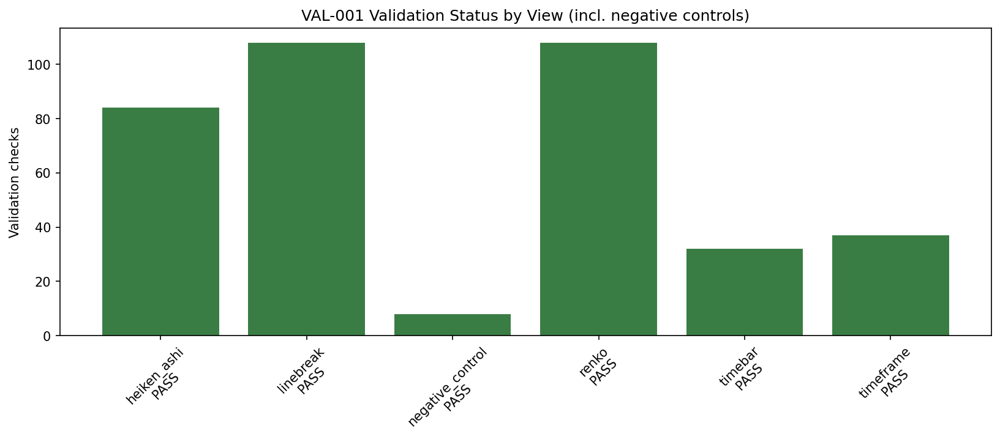

# Experiment Report: VAL-001 - Data Architecture Temporal Integrity Validation

## Status: COMPLETED

**Date**: 2026-06-01
**Instruments**: BTCUSD, EURUSD, USTEC, XAUUSD
**Data Views / Feature Categories**: 1-minute time bars; 15-minute and
60-minute OHLC resamples; Line Break level 3; Renko ATR period 14; Heiken Ashi

---

## Question

Can the current Xen data layer be trusted to support future thesis work without
detected temporal alignment failures or look-ahead contamination in any scoped
row?

## Hypothesis

The available Xen data architecture preserves temporal alignment across scoped
time-bar, timeframe, and chart-type views, with no row-level evidence of
look-ahead bias when every derived view is generated only from the first 70% of
each chronologically ordered base dataset.

## Method Summary

VAL-001 validated all available base time-bar files using only the first 70%
chronological analysis slice. It checked base OHLC integrity, compared 15-minute
and 60-minute resamples against an independent pandas oracle, validated
chart-type timestamp mappings, tested prefix stability and deterministic
regeneration, and required eight injected negative controls to be detected.

No strategy returns, P&L, forecasts, stops, targets, or parameter optimization
were in scope.

## Key Findings

### Finding 1: All validation checks passed

The run produced 377 validation rows: 377 PASS, 0 FAIL, and 0 INCONCLUSIVE.
Each real instrument contributed 92 PASS checks, and the synthetic control group
contributed 9 PASS checks.

This directly satisfies the predefined architecture-readiness criterion: every
scoped instrument, timeframe, and chart-type view passed its critical checks.

### Finding 2: Every negative control was detected

All eight negative controls were detected. The controls covered corrupted
resample values, dropped resample rows, future source timestamps, unmapped source
timestamps, `CloseTime != SourceCloseTime`, corrupted Heiken Ashi real prices, an
intentionally look-ahead generator, and determinism sensitivity.

This matters because the suite would be invalid if checks only passed by
construction. The negative controls show the relevant checks can fail when the
fault they guard against is injected.

### Finding 3: Timeframe and chart-type denominators behaved as expected

The 15-minute and 60-minute resamples matched the independent oracle with zero
row or OHLC disagreements. Heiken Ashi emitted one row per source row in all
instrument/timeframe combinations. Line Break densities ranged from 0.195149 to
0.275556 event rows per source row; Renko densities ranged from 0.222171 to
0.298266.

Renko produced 107,824 duplicate `SourceCloseTime` groups and 128,556 extra
same-source rows across all scoped outputs. These were explicitly reported and
are valid under the scoped denominator rule because one source bar can confirm
multiple bricks.

## Conclusion

**Hypothesis SUPPORTED.**

The current Xen data layer is ready to support the next research thesis from a
temporal-integrity standpoint. The support is deterministic rather than
statistical: it rests on zero observed validation failures across the scoped
files and successful detection of every injected fault.

This does not mean future strategy results will be profitable or predictive. It
means the current base data, timeframe aggregation, and chart-type generation
passed the timestamp-alignment and no-look-ahead gate needed before downstream
thesis work should rely on them.

## Limitations

- The validation covers the four base files available at run time, not future
  data files or future generator changes.
- Prefix stability and determinism were tested on bounded leading windows, while
  full generated outputs were checked for timestamp alignment.
- No active checkpoint `design.md` exists, so this result acts as a
  thesis-readiness gate rather than evidence for a specific active phase.
- `run_metadata.json` does not record a script hash; the audit found this
  non-blocking, but future validation scopes could add it.

## Implications for Future Research

- A first active thesis checkpoint can now be designed on top of the validated
  data layer.
- Any future change to chart generators, `aggregate_ohlc()`, or the loading
  convention should trigger a fresh VAL rerun before downstream experiments rely
  on it.
- Downstream experiments must still enforce real-price outcome discipline:
  strategy returns and P&L remain outside this validation and must use real
  time-matched prices.

## Recommended Next Experiments

1. **EXP-001 (proposed)**: Define the first thesis checkpoint and run a narrow
   signal-quality experiment using the validated data-layer assumptions.
2. **VAL-002 (conditional)**: Rerun temporal-integrity validation if data files,
   chart generators, `aggregate_ohlc()`, or holdout-loading conventions change.

## Artifacts

| Artifact | Path |
|----------|------|
| Scope | [scope.md](scope.md) |
| Analysis Plan | [analysis-plan.md](analysis-plan.md) |
| Code | [code/run_experiment.py](code/run_experiment.py) |
| Audit | [audit.md](audit.md) |
| Results | [results.md](results.md) |
| Governance Reviews | [governance/](governance/) |
| Raw Result Tables | [results/](results/) |
| Plots | [plots/](plots/) |
